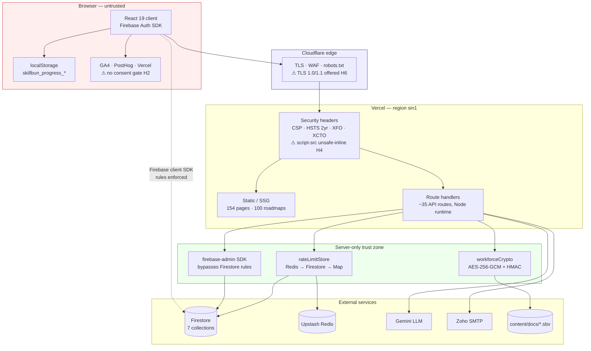
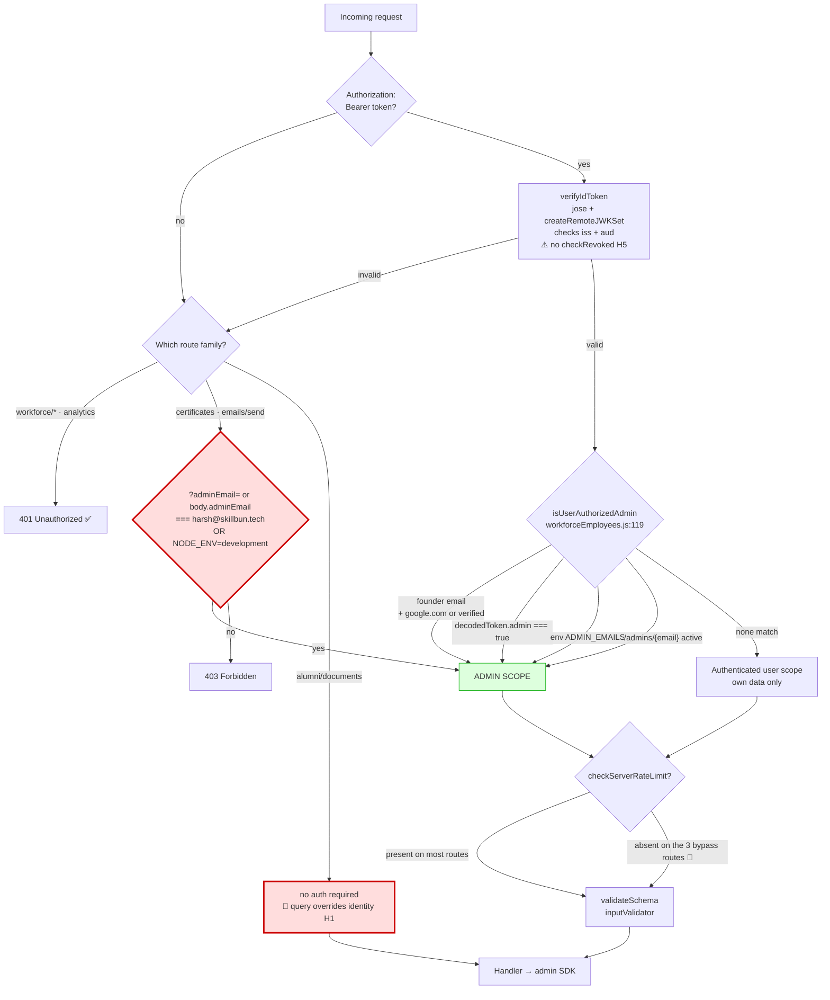
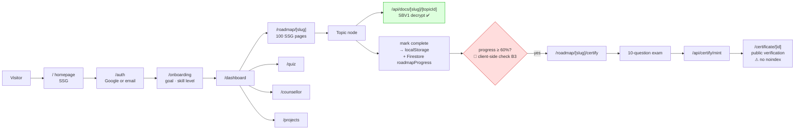
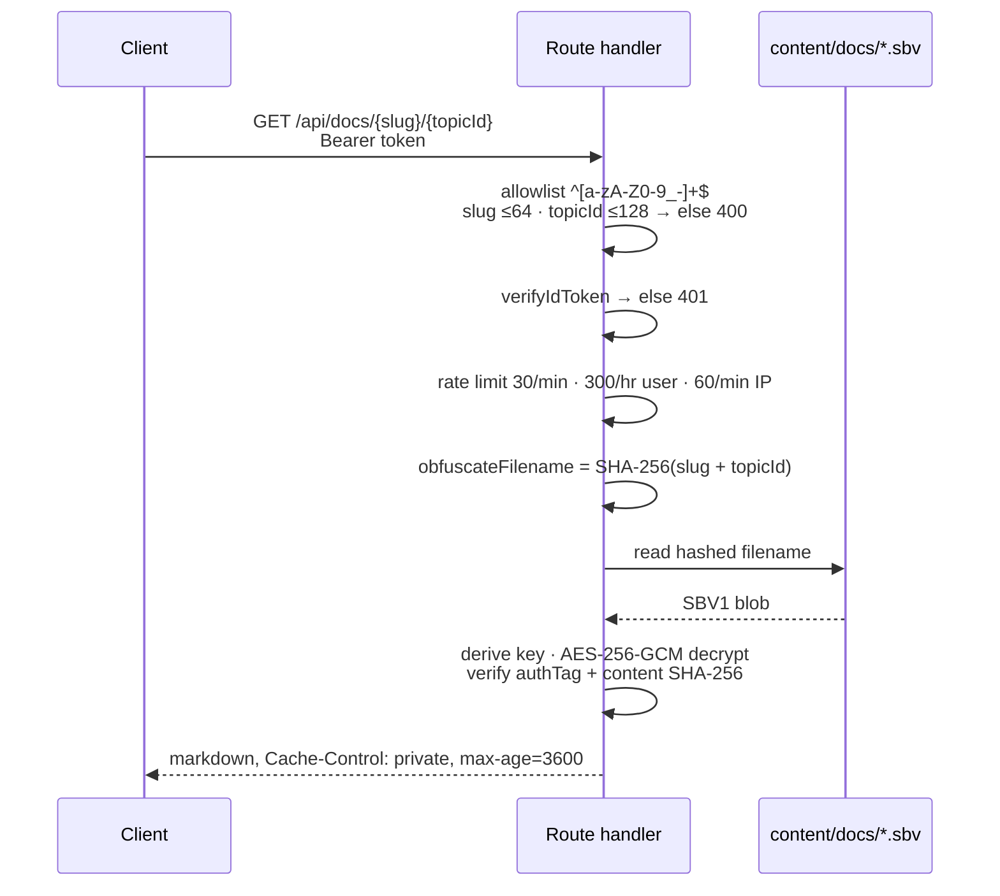
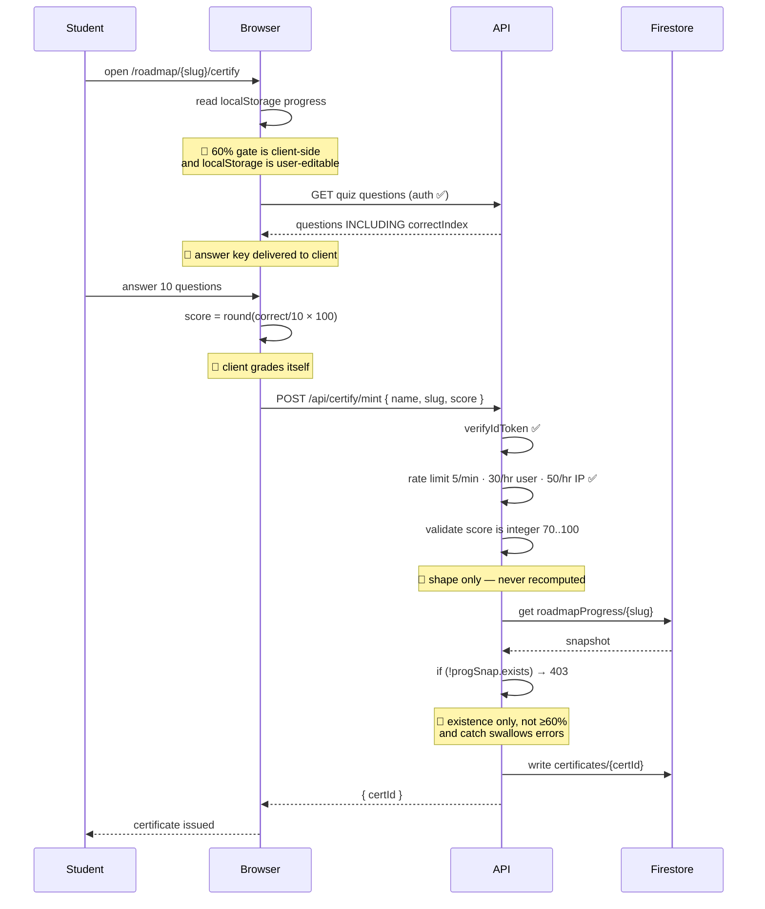
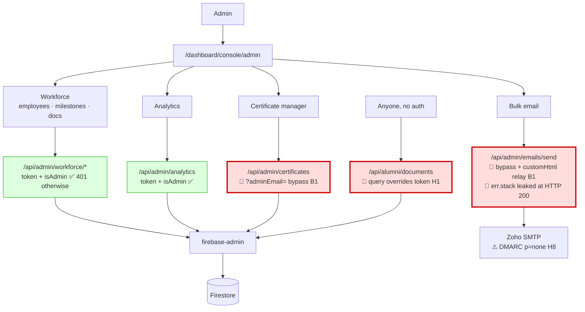
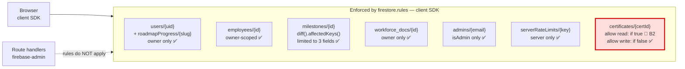
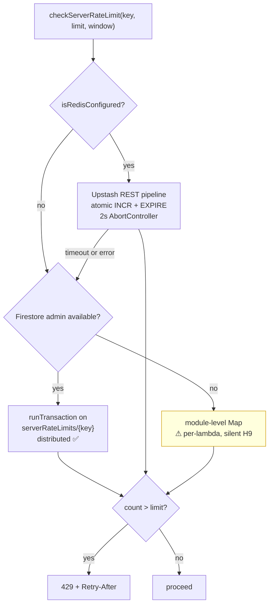
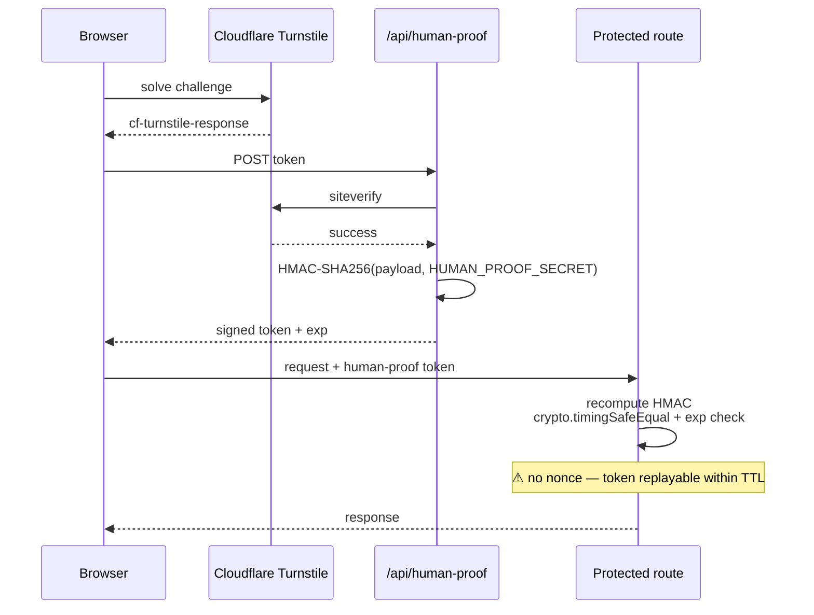
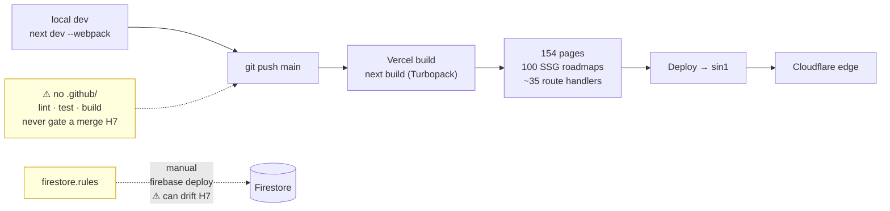

# SkillBun — Architecture & Workflow Documentation

**Version:** 2.9.3 · **Last updated:** 2026-09-05
**Companion doc:** [PRODUCTION_AUDIT_REPORT.md](PRODUCTION_AUDIT_REPORT.md) — security findings referenced here as `[B1]`, `[H4]`, etc.

Diagrams are Mermaid; they render on GitHub and in most Markdown viewers. Where a diagram carries a `🔴`/`⚠` marker, the annotation points at a live audit finding rather than intended behaviour.

---

## 1. Stack at a glance

| Layer | Technology |
|---|---|
| Framework | Next.js 16.3.1 (App Router, JSX — no TypeScript) |
| UI | React 19.2, Tailwind, `next/font` (Fredoka 700, Nunito 400/600/700/800) |
| Auth | Firebase Auth (Google OAuth + email/password) |
| Data | Cloud Firestore — client SDK in the browser, `firebase-admin` on the server |
| Hosting | Vercel (region `sin1`) behind Cloudflare (DNS, TLS, WAF, managed `robots.txt`) |
| Rate limiting | Upstash Redis REST → Firestore transaction → in-process `Map` |
| Content vault | AES-256-GCM encrypted `.sbv` files under `content/docs/` |
| LLM | Gemini (counsellor, quiz assist) |
| Mail | Zoho SMTP via nodemailer |
| PDF | `pdf-lib` server-side, plus browser print CSS |
| Bot defence | Cloudflare Turnstile + HMAC-SHA256 "human proof" tokens |
| Analytics | GA4 `G-XTFMS5Q59C`, PostHog, Vercel Analytics, Vercel Speed Insights |
| Build | Turbopack — 154 pages, 100 roadmaps pre-rendered |

---

## 2. System topology

Two trust boundaries matter:

1. **Browser → server.** Nothing the client sends is authoritative. This is where `[B3]` breaks down: the certify page computes its own exam score and the server accepts it.
2. **Route handler → Firestore.** The client SDK is constrained by `firestore.rules`; `firebase-admin` is not. Any route using the admin SDK must re-implement authorization itself. `[B1]` and `[H1]` are both failures of that second gate.

---

## 3. Authentication and authorization

**The intended path** is the right-hand chain: verified token → layered admin resolution → rate limit → schema validation → admin SDK. `isUserAuthorizedAdmin` is well built; the client-side `useAdmin` hook only affects what the UI renders and is never trusted server-side.

**The defect** is the red `?adminEmail=` node. Three files fall back to a string comparison on a client-supplied value when token verification fails:

- [app/api/admin/certificates/route.js:31](../app/api/admin/certificates/route.js#L31) — guards `GET` and `POST`
- [app/api/admin/certificates/[id]/route.js:30](../app/api/admin/certificates/[id]/route.js#L30) — guards `GET`, `PATCH`, `DELETE`
- [app/api/admin/emails/send/route.js:62](../app/api/admin/emails/send/route.js#L62) — also reads `adminEmail` from the JSON body

Everything else under `/api/admin/` returns 401 correctly, verified with and without the parameter.

---

## 4. Student journey

### The study-guide vault — reference implementation

`/api/docs/[slug]/[topicId]` is the strongest route in the codebase and the pattern other routes should copy:

Because the on-disk name is a hash, the path is not attacker-influenced at all — traversal is structurally impossible rather than filtered out. The allowlist, length caps, auth, rate limits, and integrity check all sit in front of that.

---

## 5. Certification flow

**What holds:** authentication, rate limiting, ID generation, and the `pdf-lib` render path. Workforce credential types (`INTERNSHIP`, `TRAINING`, `LOR`) correctly require `isAdmin` and cannot be self-minted.

**What does not:** every step that establishes *merit*. Fixing `[B3]` means issuing an attempt ID alongside the questions, keeping the answer key server-side, submitting answer indices for server grading, and having `mint` read the score from that attempt record instead of the request body.

---

## 6. Admin and workforce console

Green nodes are correctly gated. The three red nodes are reachable without any credential; `/api/admin/emails/send` combines that with attacker-authored `customHtml` delivered over the org's own SMTP, which is why `[B1]` and `[H8]` compound each other.

---

## 7. Data model and rules

Six of seven collections deny anonymous reads — confirmed by direct unauthenticated probes of the Firestore REST API, all returning `403 PERMISSION_DENIED`. `certificates` returns `200` with `email`, `name`, `uid`, `employee_id`, `department`, `designation`, and `recommendation_text`.

The rules file itself is otherwise well written: `hasOnly` field allowlists, string length caps, list-size bounds (`completedNodeIds ≤ 800`), and a three-field restriction on intern milestone updates. `isAdmin()` resolves through a custom claim, the founder email, or an `/admins/{email}` document.

Note the dashed line: any route using `firebase-admin` sidesteps this entire diagram. That is by design, and it is exactly why the API-layer authorization in §3 has to be airtight.

---

## 8. Rate limiting

Buckets are keyed per-user and per-IP. Representative limits: docs 30/min + 300/hr user + 60/min IP; certify mint 5/min + 30/hr user + 50/hr IP. The Firestore tier is what makes this genuinely distributed rather than best-effort. Two gaps: the memory fallback is per-lambda on Vercel and fails silently, and the three `[B1]` routes call `checkServerRateLimit` zero times.

---

## 9. Bot defence

The HMAC verification in [utils/server/humanProof.js](../utils/server/humanProof.js) is correct: SHA-256, base64url, expiry enforcement, constant-time comparison with a length pre-check. Two operational caveats — there is no replay protection inside the TTL, and `getHumanProofSecret()` will seed itself from an LLM API key if the dedicated secret is unset, returning `''` in production rather than failing loudly.

---

## 10. Build and deploy

`npm test` covers two files (`idSystem`, `pdfAndPrintSystem`) — 19 assertions, all passing, against ~35 API routes. No workflow file exists, so nothing blocks a merge. Firestore rules are deployed by hand, meaning production rules can silently diverge from the repo; adding emulator tests plus a deploy step would close both gaps at once.

---

## 11. Environment variables

Full inventory in `.env.example` (35 vars). Grouped by role:

| Group | Variables |
|---|---|
| Firebase client | `NEXT_PUBLIC_FIREBASE_*` (apiKey, authDomain, projectId, storageBucket, messagingSenderId, appId) |
| Firebase admin | `FIREBASE_PROJECT_ID`, `FIREBASE_CLIENT_EMAIL`, `FIREBASE_PRIVATE_KEY` |
| Crypto | `SBV_MASTER_KEY`, `WORKFORCE_ENC_KEY`, `HUMAN_PROOF_SECRET` |
| Rate limiting | `UPSTASH_REDIS_REST_URL`, `UPSTASH_REDIS_REST_TOKEN` |
| LLM | `GEMINI_API_KEY`, `GROQ_API_KEY`, `OPENROUTER_API_KEY` |
| Mail | `ZOHO_SMTP_HOST`, `ZOHO_SMTP_PORT`, `ZOHO_SMTP_USER`, `ZOHO_SMTP_PASS` |
| Bot defence | `NEXT_PUBLIC_TURNSTILE_SITE_KEY`, `TURNSTILE_SECRET_KEY` |
| Analytics | `NEXT_PUBLIC_POSTHOG_KEY`, `NEXT_PUBLIC_POSTHOG_HOST` |
| Admin | `ADMIN_EMAILS`, `NEXT_PUBLIC_ADMIN_EMAILS` ⚠ remove — ships the admin list to every browser |

`.env` has never been committed (full git history checked). Accessors live in [utils/server/env.js](../utils/server/env.js); two behaviours to be aware of — `getHumanProofSecret()` falls back to an LLM key and then to `''`, and `getAdminEmails()` hardcodes `['harsh@skillbun.tech']` as its default.

---

## 12. Known deviations from intent

Quick index of where the running system differs from the design above. Details and fixes in the [audit report](PRODUCTION_AUDIT_REPORT.md).

| ID | Deviation | Diagram |
|---|---|---|
| B1 | `?adminEmail=` grants admin without a token on 3 routes | §3, §6 |
| B2 | `certificates` collection world-readable | §7 |
| B3 | Exam graded and gated client-side | §5 |
| H1 | `/api/alumni/documents` unauthenticated IDOR | §3, §6 |
| H2 | Analytics load before any consent | §2 |
| H4 | CSP permits `unsafe-inline` in production | §2 |
| H5 | Auth stub lacks `checkRevoked`, `deleteUser`, `revokeRefreshTokens` | §3 |
| H6 | TLS 1.0/1.1 offered at the edge | §2 |
| H7 | No CI; rules deployed manually | §10 |
| H8 | DMARC `p=none`, no DKIM | §6 |
| H9 | Rate limiter degrades silently to per-lambda memory | §8 |
