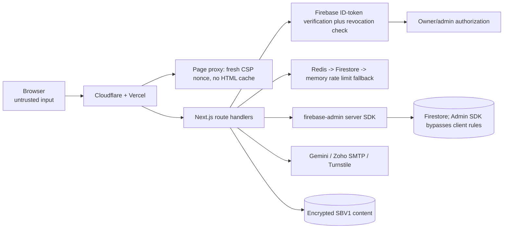
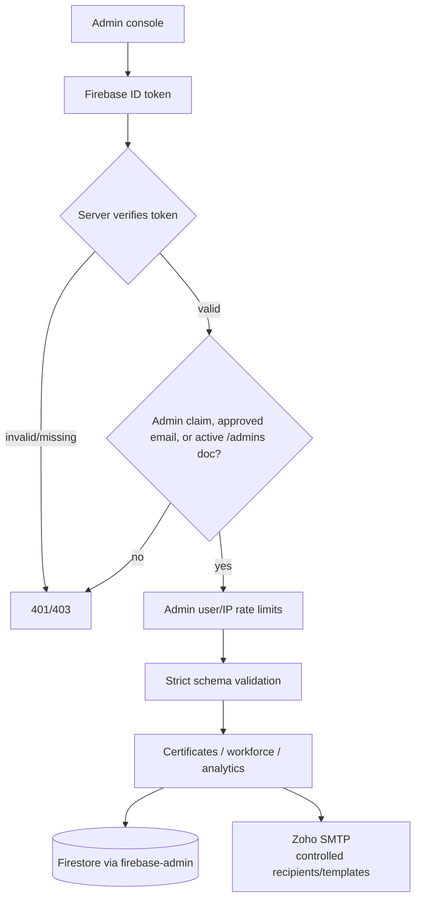
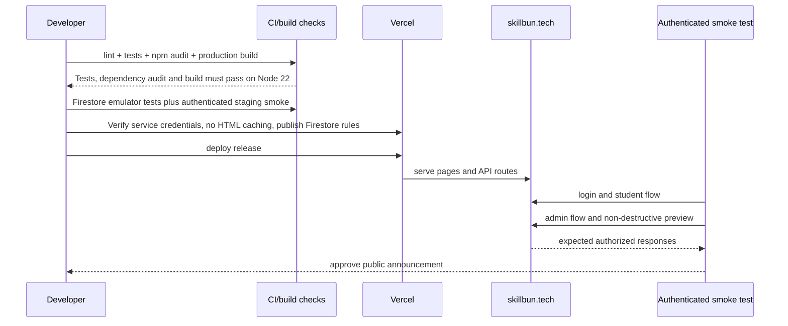

# SkillBun Current Architecture & Production Workflow

**Release:** 2.10.12  
**Updated:** 2026-09-08  
**Companion audit:** [PRODUCTION_AUDIT_REPORT_2026-09-08.md](PRODUCTION_AUDIT_REPORT_2026-09-08.md)

**Current authority:** [Hardening results and remaining release gates](HARDENING_RELEASE_REPORT_2026-09-08.md). Changes below describe the local release candidate, not an already deployed release.

## End-to-end workflow

```mermaid
flowchart TD
    V[Visitor] --> H[Homepage]
    H --> O[Onboarding]
    O --> A[Firebase Auth\nGoogle or email/password]
    A --> P[Profile + preferences]
    P --> Q[Career discovery quiz]
    Q --> R[Career recommendations]
    R --> RM[Roadmap catalog\n100 roadmap definitions; dynamically rendered pages]
    RM --> T[Roadmap progress]
    T --> SG[Study guide request]
    SG --> DOCS[/api/docs/:slug/:topicId]
    DOCS --> AUTH{Bearer token valid?}
    AUTH -->|no| D401[401]
    AUTH -->|yes| RL1[User/IP rate limits]
    RL1 --> SBV[SBV1 lookup + AES-GCM decrypt\ncontent hash verification]
    SBV --> GUIDE[Markdown guide rendered in client]
    T --> GATE{At least 60% progress?}
    GATE -->|no| T
    GATE -->|yes| START[/api/certify/start]
    START --> ATT[Atomic quota reservation + examAttempts creation\nanswer key never client-readable]
    ATT --> EXAM[10-question exam\nclient receives no answer key]
    EXAM --> SUBMIT[/api/certify/submit]
    SUBMIT --> GRADE[Transactional server grading\nowner + status + expiry checks]
    GRADE --> PASS{Score >= 70%?}
    PASS -->|no| RETRY[Retry/cooldown controls]
    PASS -->|yes| MINT[/api/certify/mint\ntransaction binds score, name, title; consumes attempt]
    MINT --> CERT[(Firestore certificates)]
    CERT --> VERIFY[Public certificate verification\nexact document read]
```

## Trust boundaries



Rules for the boundary:

- Browser scores and query parameters are not authority. Learning progress remains self-reported; the server validates the 60% threshold, not actual study completion.
- Admin routes require a verified bearer token and server-side admin resolution.
- Direct client writes to certificates and exam attempts are denied by Firestore rules.
- Public certificate verification is an exact-document lookup; collection listing is admin-only or restricted by an owner UID query. Existing exact public reads still expose whole records; field minimization remains a release decision.
- Study guides require auth before decrypting content.
- Email dispatch is an admin-only server action and must remain rate-limited.

## Admin workflow



## Current release controls

| Control | Current state |
|---|---|
| Runtime | Node 22, Next.js webpack production build |
| Auth compatibility | `jose` 4.x CommonJS-compatible pin retained for Firebase/JWKS deployment path |
| Protected API behavior | Missing-auth probes return 401; wrong methods return 405 |
| Firestore exposure | Anonymous certificate/exam collection listing returns 403 |
| Consent | Local fix: load analytics only after consent; privacy page can reopen choices |
| Content | Local proxy blocks plaintext banks; live fullstack bank still returned 200 during recheck |
| Security headers | Local nonce CSP verified; live site has the older policy |
| Monitoring follow-up | Add production 5xx, latency, Redis, SMTP, and Firestore alerts |

## Launch sequence



## Operational warning

The current audit verifies unauthenticated denial and static/build health. It does not create accounts or perform production writes. Before announcement, run the controlled authenticated smoke test and confirm alerting for unexpected 5xx responses.
