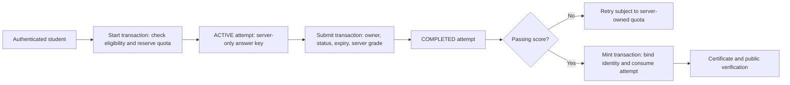

# SkillBun — hardening results and production release gates

Date: 2026-09-08. Site: https://skillbun.tech/. Repository: https://github.com/anonymousgrouphp-collab/skillbun. Baseline: `dec925c`, package 2.10.12, plus uncommitted local hardening changes. No commit, push, rule publication, or deployment was performed.

## Verdict

**Not approved for production launch yet.** Targeted code fixes and local checks are completed, but the live site does not contain this patch. Four of 15 live smoke assertions failed. Earlier conditional approval in the historical report is superseded.

This is an evidence-based re-audit and remediation pass, not a claim to have exhaustively tested every input, user journey, browser, or legal requirement. Prior agent quota failures do not count as successful coverage. Production tests were read-only; no real email, certificate, account, or workforce changes were made. Responses containing possible personal data were not included in this report.

## Changes implemented

| Finding | Risk | Local remediation | Verification boundary |
|---|---|---|---|
| Exam answer records readable by their owner | High | Deny all direct client reads of `examAttempts`; sanitized start response remains | Rules source reviewed; rules emulator still required |
| Client-editable cooldown history | High | Deny client writes to `users/{uid}/quizAttempts`; backend reserves quota and creates attempt in one transaction | Source review; concurrent start emulator test still required |
| Concurrent submit and mint races | High | Transactions check owner/status before grading or issuing; only one mint consumes an attempt | Transaction-double regression tests pass; not a real Firestore concurrency test |
| Certificate name/title drift at mint | Medium | Mint takes name, title and passing score from its server attempt | Regression tests pass; candidate-supplied start name is not identity verification |
| Unverified email used for administrator/employee authority | High | Email-based roles require `email_verified`; inactive registry entries rejected; explicit admin claims preserved | Source review; test all role combinations in staging |
| Disabled/deleted/revoked account tokens accepted | High | Use Firebase Admin `verifyIdToken(token, true)`; missing service credentials fail closed; expose actual `listUsers` wrapper | Build and source guardrail pass; revoked-user lifecycle test still required |
| Alumni email query disguised as a reference | High | Use actual credential ID validator, preserve legacy ID case, require verified owner email for private documents, add rate limit and no-store | Local malformed email query returns 401; live still 200 |
| Static certification answer banks downloadable | High | Proxy denies plain and encoded quiz/docs paths; encrypted career bank remains authenticated | Local existing `fullstack.json` and encoded path both 404; live both 200 |
| Production CSP allows arbitrary inline scripts | Medium | Per-request cryptographic nonce, dynamic HTML/no-store, block script attributes; restrict objects to generated blob PDFs and preserve PDF data frames | Local header, HTML nonce and browser checks pass; older live policy remains |
| Analytics loaded before consent/contact traits collected | Medium | Gate SDK initialization/loading, suppress contact/free-text event properties, disable automatic exception capture/session recording, add withdrawal control and GA disable flag | No analytics requests before consent; decline persists; acceptance delivery and every vendor behavior not fully tested |
| Redis counter expiry could be lost in detached request | Medium | Increment + expiry repair happen in one Lua operation per bucket; malformed replies fall back; request timeout covers response parsing | Code/build reviewed; Redis integration/outage test pending |
| Human proof could be renewed indefinitely | Medium | Return existing proof with original expiry; add IP limit and 8-second verification timeout; bypass only in development | Source reviewed; actual CAPTCHA challenge test pending |
| Search field lacked accessible name | Low | Add descriptive aria-label, without design or behavior changes | Final browser rerun has no unlabeled homepage inputs |

## Current evidence

- Unit/security/roadmap/PDF tests: **37 passed, 0 failed**. Includes eight new hardening tests and correction of an old test that reproduced the same faulty reference regex instead of importing real validation.
- Production build: completed successfully with webpack and Next.js 16.3.1 under Node 22.23.2 after the final code edits. Root nonce handling intentionally makes HTML pages dynamically rendered; build's 158 generated entries do not mean 158 cached HTML pages.
- ESLint: final run passed with no reported warnings/errors.
- `npm audit` including development packages: **0 known vulnerabilities reported**, 645 dependency entries. This is not a guarantee of absence of undisclosed vulnerabilities.
- Secret-pattern scan: 3,544 tracked paths enumerated; selected text extensions checked for private-key blocks, JWTs and common cloud/live-token formats; no matching files. This was not a complete Git-history or all-secret-format scan.
- Local production smoke: **15/15 pass**. Checks homepage nonce/no-store, privacy, robots, sitemap, manifest, favicon, admin denial, alumni gate, authenticated content denial, and plaintext-bank denial.
- Browser (headless Edge): no page errors or detected CSP violations; every executable inline script had a nonce; zero analytics requests before consent; decline persisted and GA disable flag set; skip link first in keyboard order; no image missing alt attribute; no horizontal overflow at 1365 and 390 px. This does not prove correct alt content, all keyboard paths, contrast, or screen-reader support.
- Initial checks ran under Node 26.7.0; the final build and all 37 tests were also rerun successfully under **Node 22.23.2**, matching the deployment major version. A clean CI `npm ci` run still remains required; local verification reused installed dependencies.
- Eight local POST denial checks passed: missing and invalid tokens return 401 for certification start, submit, mint and admin email. No valid credential was used and no records or emails were created. Admin email also now rejects null/array JSON with 400 before dereferencing payload fields.

### Live versus local smoke results

| Probe | Local | Live |
|---|---|---|
| Homepage status | 200 | 200 |
| Homepage nonce CSP + no-store assertion | Pass | Fail (older deployed policy) |
| Privacy, robots, sitemap, manifest, favicon | 200 | 200 |
| Admin certificates, including old email-query shortcut | 401 | 401 |
| Anonymous ordinary alumni email query | 401 | 401 |
| Malformed reference/email (`sb/audit@example.test`) | 401 | 200 — auth-gate failure; private-PDF exfiltration not tested |
| Quiz/study-guide API without a token | 401 | 401 |
| Existing `data/quizzes/fullstack.json` | 404 | 200 |
| Encoded `data/%71uizzes/fullstack.json` | 404 | 200 |
| Nonexistent plaintext guide path | 404 | 404 — absence alone does not prove all content is protected |

Reproduce with `npm run audit:smoke -- http://localhost:3000` and, after deployment, `npm run audit:smoke -- https://skillbun.tech`. The script uses GET only, suppresses bodies and exits nonzero on failure. It is a release check, not an installed recurring monitor.

## Standard prelaunch coverage matrix

| Standard area | Status / evidence | Remaining acceptance check |
|---|---|---|
| Authentication and session lifecycle | Local hardening | Staging login, logout, refresh, disabled/deleted user and revoked token tests |
| Authorization / IDOR | Admin anonymous denial live; alumni bypass fixed locally | Owner A vs B, verified/unverified emails, inactive admin, custom-claim matrix |
| Firestore rules | Source hardening | Emulator tests for get/list/create/update/delete for every collection; publish rules separately |
| Assessment integrity | Transaction helper tests | Concurrent start/submit/mint in emulator; real student lifecycle; bank confidentiality decision |
| Input validation / injection / traversal | Existing validation suite; strict attempt/reference validation | Endpoint-by-endpoint malformed-body matrix and each HTML sink review |
| XSS / security headers | Nonce policy and browser smoke pass locally | Authenticated pages, PDF printing, OAuth/CAPTCHA and all third-party embeds under CSP |
| CSRF / CORS | Bearer-token auth retained; no auth cookie introduced | Full origin/method/header matrix; unsafe operations never tested against live data |
| Rate limits / CAPTCHA | Redis atomic expiry and human-proof lifetime fixed | Redis outage/fallback concurrency, trusted-proxy IP headers, actual 429 and CAPTCHA replay cases |
| Secrets / cryptography | Current tracked-text scan; SBV1 untouched | Dedicated full-history scan, credential rotation/access audit and key recovery drill |
| Dependency / supply chain | npm audit zero; lockfile retained | Clean Node 22 `npm ci`, provenance/CI permissions and advisory monitoring |
| Privacy / consent | Default-deny loading; withdrawal control | Acceptance/withdrawal across all SDKs, retention/deletion inventory, vendor agreements and qualified policy review |
| Accessibility | Basic browser labels, skip link, alt attributes, overflow | Full WCAG audit: contrast, focus handling, keyboard traps, mobile targets, screen reader and reduced-motion behavior |
| Functional / UX | Anonymous homepage/privacy smoke; PDF tests | Signed-in onboarding, quiz, recommendations, roadmap, docs, certificate, admin and workforce workflows |
| Browser/device compatibility | Headless Edge desktop/mobile-width sample | Real mobile Safari, Chrome, Firefox and touch/zoom testing |
| Performance / Core Web Vitals | No local overflow; dynamic HTML tradeoff recorded | Lighthouse/field LCP, INP, CLS, throttled mobile and bundle budget; representative load test |
| SEO / indexing | Robots/sitemap/manifest/favicon endpoints return 200 | Canonicals, structured-data validation, robots Cloudflare/app policy reconciliation and private-page noindex |
| Email / deliverability | No email sent; admin gate retained | Safe staging mailbox, reply-to/from contract, SPF/DKIM, DMARC enforcement and bounce handling |
| TLS / DNS / edge | HTTPS fetch succeeds | Protocol/cipher scan, certificate renewal, CAA/DNSSEC decisions, CDN origin protection |
| Reliability / observability | Existing error boundaries preserved; new timeout | 5xx/latency alerts, rate-limit degradation alert, SMTP/AI failures, on-call ownership |
| Backup / restore / recovery | Not exercised | Firestore export/restore, key recovery, documented RPO/RTO and rollback rehearsal |
| Data migration / compatibility | No stored data migration; legacy ID casing retained | Existing owner certificate listing, active exams and workforce PDF compatibility |
| Capacity / abuse / cost | No load or AI traffic generated | Staging capacity/cost limits; AI quotas and distributed fallback stress test |
| CI / deployment / rollback | Existing CI retained; new tests included by npm test | Node 22 CI pass, release version bump on commit, coordinated app/rules rollout, known-good rollback |
| Legal / product claims | Unsupported compliance badge removed | Review policy accuracy, public credential data, learner claims and accessibility obligations; no legal certification provided |

## Blocking decisions and configuration before launch

1. **Deploy the app and publish `firestore.rules` together.** Old clients must not be allowed to read answer keys or alter cooldowns. Re-run live smoke and authenticated staging tests. Existing active tests may be invalidated; announce the maintenance window if needed.
2. **Firebase credentials are now required for authenticated API calls**, including revocation checks: confirm `FIREBASE_ADMIN_PROJECT_ID`, `FIREBASE_ADMIN_CLIENT_EMAIL`, `FIREBASE_ADMIN_PRIVATE_KEY` through the existing environment getters. Do not paste values into source, issues or logs. The service identity needs Auth user lookup permission in addition to existing Firestore access. Verify exact configured names against `.env.example`/`utils/server/env.js` before deployment.
3. **Cloudflare must not cache nonce HTML or private API responses.** Honor origin `private, no-store`, disable conflicting Cache Everything/HTML cache rules, and purge previously cached answer-bank paths. Static images/fonts/scripts can remain cached. Nonce HTML increases server-rendering cost and latency; establish a performance budget.
4. **Public repository history still contains certification questions/answers.** Blocking the website URL cannot make already published material secret. Decide whether certification is open-book or approve private bank storage plus new offline-generated questions. Do not call the static bank secret or claim the client proctor overlay prevents external assistance. No offline Gemini calls were made.
5. **Public exact certificate reads still expose complete existing records**, potentially including email/UID fields, because the repository's explicit public-verification contract is preserved. Approve a separate minimal public projection/API and restricted private storage if those fields are not intended for disclosure. Masking the alumni response alone does not change Firestore exact reads.
6. **Learning completion remains self-reported**, and the server enforces the aggregate attempt deadline, not independently timestamped 45-second question delivery. UI restrictions cannot prove study completion or enforce a trustworthy per-question clock. Stronger assurance needs a separately approved assessment protocol.
7. **Redis/Firestore fallback remains available by repository contract.** Configure existing Upstash/KV variables for distributed limits and alert on `SECURITY_DEGRADATION_ALERT`. In-memory production fallback is not cross-instance abuse protection. Verify trusted ingress overwrites client IP headers.
8. **Complete staging and operational gates:** rules emulator, Node 22 CI, signed-in flows, SPF/DKIM/DMARC, monitoring, retention and backup restore. These were not performed against production and must not be represented as passed.

No new paid services or environment-variable names were introduced. No DNS, Firebase rules, hosting settings, SMTP configuration, external notifications or automation schedules were changed.

## Workflow and maintenance

See [architecture diagrams](ARCHITECTURE_WORKFLOW_2026-09-08.md) for student, admin and deployment flows. The critical state transitions are:

Rulebook pass: changes are scoped to confirmed security/privacy/accessibility issues, regression tests and documentation. Branding, splash, homepage hero/floaters, footer and theme design are preserved. Root layout changed only for nonce/consent wiring; search changed only for its accessible name. Auth, API, assessment, rules and abuse prevention were intentionally hardened. Preview: http://localhost:3000. Test and deployment limitations are recorded above.
