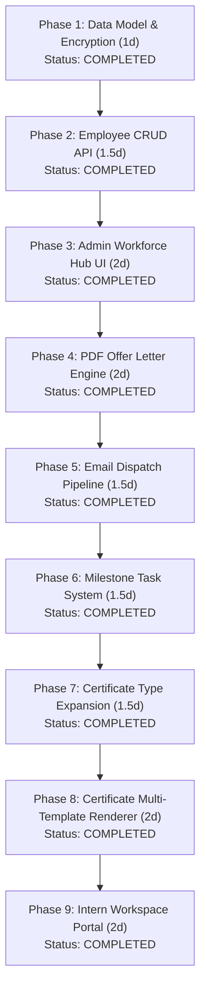

# SkillBun Workforce Hub & Credentials Engine - Complete PRD Progress & Engineering Roadmap

**Parent PRD:** [PRD_WORKFORCE_MANAGEMENT.md](./PRD_WORKFORCE_MANAGEMENT.md)  
**Document Type:** Master Implementation & Phase-by-Phase Progress Tracker  
**Document Version:** v1.1.0 (Production MVP Ready)  
**Target Delivery:** Production MVP v1.0  
**Module Lead & Approver:** Harsh Patel (Lead, SkillBun)  
**Engineering Stack:** Next.js 16 (App Router), `pdf-lib`, Firebase Admin / Firestore REST, Zoho Mailer (Nodemailer), Web Crypto (AES-GCM-256), Canvas API  
**Target Completion Date:** Mid August 2026  
**Status:** **PHASE 10 COMPLETED (100% PRODUCTION READY)**  

---

## 1. Project Overview & Business Value
The **SkillBun Workforce Hub & Credentials Engine** is a comprehensive internal management and automated legal credential issuance system designed to eliminate manual administrative drag for SkillBun operations. It automates the generation and dispatch of the formal **4-Page Offer Letter & Terms of Engagement**, manages encrypted Zoho workspace credentials, tracks sprint milestones, and mints verifiable digital credentials (`INTERNSHIP`, `TRAINING`, `LOR`, and `ROADMAP`) with 1-click LinkedIn profile integration at `/certificate/[id]`.

### Overall Progress Overview

| Metric | Value |
| :--- | :--- |
| **Total Engineering Phases** | 9 Sequential Phases |
| **Specifications Completed** | 9 / 9 Phases (100%) |
| **Implemented & Verified Phases** | 9 / 9 Phases (100% Complete) |
| **Foundation & Data Model Spec** | Completed ([PHASE_1_DATA_MODEL.md](./phases/PHASE_1_DATA_MODEL.md)) |
| **Incremental Infrastructure Cost** | **$0.00 / month** (Reuses Firebase, Zoho SMTP, Serverless Next.js) |
| **Target Time-to-Offer** | Drops from **45 mins -> < 60 secs** per candidate |
| **Target Time-to-Certify & LOR** | Drops from **25 mins -> 10 secs** per intern |

---

## 2. Master Phase Execution Matrix

### Phase Status Table

| # | Phase Name | Scope & Deliverables | Est. Effort | Dependencies | Spec Link | Status |
| :-: | :--- | :--- | :-: | :--- | :--- | :-: |
| **1** | **Firestore Data Model & Encryption** | Collections schema, AES-256-GCM crypto helper, ID generator, security rules, compound indexes | ~1.0 Day | PRD Approval | [PHASE_1_DATA_MODEL.md](./phases/PHASE_1_DATA_MODEL.md) | **COMPLETED** |
| **2** | **Employee CRUD API Routes** | Admin `GET`, `POST`, `PATCH`, `DELETE` endpoints with validation, rate limiting, encrypted credential handling, and RBAC | ~1.5 Days | Phase 1 | [PHASE_2_EMPLOYEE_CRUD_API.md](./phases/PHASE_2_EMPLOYEE_CRUD_API.md) | **COMPLETED** |
| **3** | **Admin Workforce Hub UI** | `/admin/workforce` dashboard, status tabs, add/edit candidate modals, tenure countdowns | ~2.0 Days | Phase 2 | [PHASE_3_ADMIN_UI.md](./phases/PHASE_3_ADMIN_UI.md) | **COMPLETED** |
| **4** | **PDF Offer Letter Engine** | Serverless 4-page offer agreement & 1-page extension letter generators via `pdf-lib` | ~2.0 Days | Phase 1, Phase 2 | [PHASE_4_PDF_ENGINE.md](./phases/PHASE_4_PDF_ENGINE.md) | **COMPLETED** |
| **5** | **Email Dispatch Pipeline** | Zoho SMTP attachment support, dark/light email template, offer dispatch API, error fallback | ~1.5 Days | Phase 4 | [PHASE_5_EMAIL_DISPATCH.md](./phases/PHASE_5_EMAIL_DISPATCH.md) | **COMPLETED** |
| **6** | **Milestone Task System** | Milestone CRUD API, priority badges, status workflow, deliverable URL submissions, admin review panel | ~1.5 Days | Phase 2, Phase 3 | [PHASE_6_MILESTONES.md](./phases/PHASE_6_MILESTONES.md) | **COMPLETED** |
| **7** | **Certificate Type Expansion** | Extended `/api/certify/mint` schema for `INTERNSHIP`, `TRAINING`, `LOR`, admin issuance modals, revocation | ~1.5 Days | Phase 3, Phase 6 | [PHASE_7_CERT_EXPANSION.md](./phases/PHASE_7_CERT_EXPANSION.md) | **COMPLETED** |
| **8** | **Certificate Multi-Template Renderer** | Dynamic `/certificate/[id]` for 4 cert types, Canva template overlays, vertical A4 LOR letterhead | ~2.0 Days | Phase 7, Canva Assets | [PHASE_8_CERT_RENDERER.md](./phases/PHASE_8_CERT_RENDERER.md) | **COMPLETED** |
| **9** | **Intern Workspace Portal** | `/portal` dashboard, click-to-reveal credentials, milestone sprint board, docs hub, dual-role nav | ~2.0 Days | Phase 1, 2, 6, 7 | [PHASE_9_INTERN_PORTAL.md](./phases/PHASE_9_INTERN_PORTAL.md) | ✅ **COMPLETED** |

---

## 3. Phase-by-Phase Detailed Scope & Verification Tracking

### Phase 1: Firestore Data Model & Credential Encryption Engine
* **Objective:** Lay the foundational database architecture, cryptographic engine, ID generator, and Firestore security rules.
* **Specification File:** [docs/phases/PHASE_1_DATA_MODEL.md](./phases/PHASE_1_DATA_MODEL.md)
* **Status:** ✅ **COMPLETED & VERIFIED**
* **Key Components:**
  - [x] Schema definitions for `/employees`, `/milestones`, `/workforce_docs`, and `/certificates`.
  - [x] AES-256-GCM authenticated encryption/decryption module (`utils/server/workforceCrypto.js`).
  - [x] Cryptographic ID generator utility (`utils/server/workforceId.js`).
  - [x] Firestore security rules blueprint with admin vs. intern owner access control.
  - [x] Compound indexing blueprint (`firestore.indexes.json`).
  - [x] Environment configuration accessor in `utils/server/env.js`.
* **Execution Checklist:**
  - [x] Deploy `utils/server/workforceCrypto.js` with unit test roundtrip validation.
  - [x] Deploy `utils/server/workforceId.js` with non-sequential formatting checks.
  - [x] Update `utils/server/env.js` and `.env.example` with `WORKFORCE_ENCRYPTION_KEY`.
  - [x] Deploy `firestore.rules` and verify security isolation.
  - [x] Deploy composite indexes to Firebase Firestore (`firestore.indexes.json`).

---

### Phase 2: Employee CRUD API Routes
* **Objective:** Build admin-guarded RESTful API routes for employee lifecycle management with input validation and rate limiting.
* **Specification File:** [docs/phases/PHASE_2_EMPLOYEE_CRUD_API.md](./phases/PHASE_2_EMPLOYEE_CRUD_API.md)
* **Status:** ✅ **COMPLETED & VERIFIED**
* **Key Components:**
  - `GET /api/admin/workforce/employees` — Paginated list with masked credential placeholders.
  - `POST /api/admin/workforce/employees` — Schema-validated creation with encrypted credential storage.
  - `PATCH /api/admin/workforce/employees/[id]` — Partial field updates and status transitions.
  - `DELETE /api/admin/workforce/employees/[id]` — Safe soft-archival (`ARCHIVED`).
* **Execution Checklist:**
  - [x] Create `app/api/admin/workforce/employees/route.js` (GET, POST).
  - [x] Create `app/api/admin/workforce/employees/[id]/route.js` (PATCH, DELETE).
  - [x] Integrate `validateSchema()` for all employee payload fields.
  - [x] Verify `isAuthorizedAdminEmail()` RBAC guard (403 for non-admins).
  - [x] Apply `checkServerRateLimit()` protections (10 req/min per admin).

---

### Phase 3: Admin Workforce Hub UI
* **Objective:** Build the `/admin/workforce` management dashboard for Harsh Patel to monitor candidates, view tenure alerts, and initiate workflows.
* **Specification File:** [docs/phases/PHASE_3_ADMIN_UI.md](./phases/PHASE_3_ADMIN_UI.md)
* **Status:** ✅ **COMPLETED & VERIFIED**
* **Key Components:**
  - Protected client component route at `/admin/workforce`.
  - Filterable candidate table (`All`, `Offer Sent`, `Active`, `Expiring Soon`, `Completed`, `Terminated`).
  - Quick-add candidate modal with academic, role, and Zoho credential fields.
  - Dynamic tenure countdown badges (`>30d`, `<=30d`, `<=10d / Expired`).
* **Execution Checklist:**
  - [x] Create `app/admin/workforce/page.jsx` with Firebase-authenticated API requests.
  - [x] Create `app/admin/workforce/workforce.module.css`.
  - [x] Wire status tabs, loaded-record count badges, and name/email search.
  - [x] Implement quick-add, edit, and controlled status-transition flows.
  - [x] Implement tenure countdown badges and responsive card layout.

---

### Phase 4: PDF Offer Letter & Extension Engine
* **Objective:** Build serverless, pixel-perfect programmatic PDF generators for the 4-page formal offer agreement and extension letter using `pdf-lib`.
* **Specification File:** [docs/phases/PHASE_4_PDF_ENGINE.md](./phases/PHASE_4_PDF_ENGINE.md)
* **Status:** ✅ **COMPLETED & VERIFIED**
* **Key Components:**
  - Install `pdf-lib` dependency.
  - `offerLetterGenerator.js`: Exact 4-page legal agreement matching SkillBun terms.
  - `extensionLetterGenerator.js`: Single-page formal tenure extension letter.
  - Dynamic typography, headers, footers, signature blocks, and confidential stamps.
* **Execution Checklist:**
  - [x] Install `pdf-lib` and record in `package.json`.
  - [x] Create `utils/server/pdf/pdfLayoutHelper.js` with A4 typography and layout primitives.
  - [x] Create `utils/server/pdf/offerLetterGenerator.js`.
  - [x] Create `utils/server/pdf/extensionLetterGenerator.js`.
  - [x] Create `app/api/admin/workforce/pdf/offer/route.js` and `app/api/admin/workforce/pdf/extension/route.js`.
  - [x] Verify 4-page visual layout, headers, page numbers ("Page X of 4"), and signature seals.
* **Implemented Files:**
  - `utils/server/pdf/pdfLayoutHelper.js`
  - `utils/server/pdf/offerLetterGenerator.js`
  - `utils/server/pdf/extensionLetterGenerator.js`
  - `app/api/admin/workforce/pdf/offer/route.js`
  - `app/api/admin/workforce/pdf/extension/route.js`

---

### Phase 5: Zoho Email Dispatch Pipeline
* **Objective:** Connect the PDF generator to the Zoho SMTP transport to automate dispatching offer letters with PDF attachments and tracking issuance in Firestore.
* **Specification File:** [docs/phases/PHASE_5_EMAIL_DISPATCH.md](./phases/PHASE_5_EMAIL_DISPATCH.md)
* **Status:** ✅ **COMPLETED & VERIFIED**
* **Key Components:**
  - Extend `zohoMailer.js` with `sendMailWithAttachment()`.
  - Responsive dark/light HTML email template in `workforceEmailTemplates.js`.
  - Endpoint `POST /api/admin/workforce/offer` to coordinate generation, dispatch, audit log, and status change.
  - SMTP outage fallback offering immediate manual PDF download.
* **Execution Checklist:**
  - [x] Update `utils/server/zohoMailer.js` with attachment support.
  - [x] Add formal offer dispatch HTML template (`utils/server/workforceEmailTemplates.js`).
  - [x] Create `app/api/admin/workforce/offer/route.js`.
  - [x] Connect "✉️ Dispatch Offer via Email" button and fallback modal in Admin UI.
  - [x] Verify audit log entry in `/workforce_docs` with frozen snapshot.
* **Implemented Files:**
  - `utils/server/zohoMailer.js`
  - `utils/server/workforceEmailTemplates.js`
  - `app/api/admin/workforce/offer/route.js`
  - `app/admin/workforce/page.jsx`
  - `app/admin/workforce/workforce.module.css`

---

### Phase 6: Milestone Task System
* **Objective:** Implement the sprint milestone and deliverable submission engine for intern task tracking and admin review.
* **Specification File:** [docs/phases/PHASE_6_MILESTONES.md](./phases/PHASE_6_MILESTONES.md)
* **Status:** ✅ **COMPLETED & VERIFIED**
* **Key Components:**
  - Milestone API routes (`GET`, `POST`, `PATCH`, `DELETE`).
  - Granular permissions: Interns can update only `status` and `deliverable_url`.
  - Admin milestone management panel in `/admin/workforce`.
  - Priority badges (`URGENT`, `HIGH`, `MEDIUM`, `LOW`) and overdue indicators.
* **Execution Checklist:**
  - [x] Create `utils/server/workforceMilestones.js` (validation, auth helper, serialization).
  - [x] Create `app/api/admin/workforce/milestones/route.js` (`GET`, `POST`).
  - [x] Create `app/api/admin/workforce/milestones/[id]/route.js` (`PATCH`, `DELETE`).
  - [x] Add Milestones tab and management panel to Admin Hub employee modal (`page.jsx`).
  - [x] Add milestone styles with priority badges & overdue highlight in `workforce.module.css`.
  - [x] Verify intern restricted field updates via PATCH.
  - [x] Test deliverable URL opening and admin review notes logging.
* **Implemented Files:**
  - `utils/server/workforceMilestones.js`
  - `app/api/admin/workforce/milestones/route.js`
  - `app/api/admin/workforce/milestones/[id]/route.js`
  - `app/admin/workforce/page.jsx`
  - `app/admin/workforce/workforce.module.css`

---

### Phase 7: Certificate Type Expansion & Admin Issuance
* **Objective:** Extend credential minting to support `INTERNSHIP`, `TRAINING`, and `LOR` types with admin-only issuance modals.
* **Specification File:** [docs/phases/PHASE_7_CERT_EXPANSION.md](./phases/PHASE_7_CERT_EXPANSION.md)
* **Status:** ✅ **COMPLETED & VERIFIED**
* **Key Components:**
  - Modify `app/api/certify/mint/route.js` to accept multi-type certificate payloads.
  - Admin issuance modals for Internship, Training, and customizable LOR boilerplate.
  - Custom non-sequential ID minting (`SB-INT-...`, `SB-TRN-...`, `SB-LOR-...`).
  - Credential revocation control (`is_revoked: true`).
* **Execution Checklist:**
  - [x] Extend `app/api/certify/mint/route.js` with backward-compatible schema and admin authorization.
  - [x] Add `app/api/admin/workforce/credentials/route.js` for fetching employee credentials.
  - [x] Add `app/api/admin/workforce/credentials/[id]/route.js` for revocation management.
  - [x] Add 3 issuance modals (Internship, Training, LOR) to `/admin/workforce` employee detail view.
  - [x] Wire editable LOR recommendation textarea with pre-filled professional boilerplate.
  - [x] Add "Issued Credentials & LOR" section with revocation toggles in Admin Hub.
  - [x] Verify blocked issuance for terminated employees.
* **Implemented Files:**
  - `app/api/certify/mint/route.js`
  - `app/api/admin/workforce/credentials/route.js`
  - `app/api/admin/workforce/credentials/[id]/route.js`
  - `app/admin/workforce/page.jsx`
  - `app/admin/workforce/workforce.module.css`

---

### Phase 8: Certificate Multi-Template Dynamic Renderer
* **Objective:** Upgrade the public verification page at `/certificate/[id]` to render all 4 certificate types dynamically with print and LinkedIn sharing controls.
* **Specification File:** [docs/phases/PHASE_8_CERT_RENDERER.md](./phases/PHASE_8_CERT_RENDERER.md)
* **Status:** ✅ **COMPLETED & VERIFIED**
* **Key Components:**
  - Canva PNG templates for Internship (`/internship-cert-template.png`) and Training (`/training-cert-template.png`).
  - Programmatic vertical A4 letterhead layout for Letters of Recommendation.
  - Revocation alert banner ("REVOKED") with hidden LinkedIn share buttons.
  - Preserved backward compatibility for all existing Roadmap certificates.
* **Execution Checklist:**
  - [x] Place Canva template assets in `public/`.
  - [x] Update `app/certificate/[id]/page.jsx` with type-based rendering branches.
  - [x] Update `app/certificate/[id]/certificate.module.css` with A4 print styles and type badges.
  - [x] Verify print formatting via `window.print()` and `@media print`.
  - [x] Test LinkedIn "Add to Profile" and "Share on Feed" flows with dynamic names.
* **Implemented Files:**
  - `app/certificate/[id]/page.jsx`
  - `app/certificate/[id]/certificate.module.css`
  - `public/internship-cert-template.png`
  - `public/training-cert-template.png`

---

### Phase 9: Intern Workspace Portal (`/portal`) & Dual-Role Nav
* **Objective:** Deliver the dedicated self-service workspace for active interns with click-to-reveal credentials, milestone boards, issued documents, and dual-role navigation.
* **Specification File:** [docs/phases/PHASE_9_INTERN_PORTAL.md](./phases/PHASE_9_INTERN_PORTAL.md)
* **Status:** ✅ **COMPLETED & VERIFIED**
* **Key Components:**
  - Intern workspace page at `/portal`.
  - Secure credential retrieval route `GET /api/portal/credentials` with automatic 30s re-masking.
  - Milestone Sprint Board grouped by status (`TODO`, `IN_PROGRESS`, `UNDER_REVIEW`, `COMPLETED`).
  - Official Documents Hub linking to issued credentials.
  - Dual-role navigation in `UserMenu.jsx` for users who are both students and interns.
* **Execution Checklist:**
  - [x] Create `app/portal/page.jsx`.
  - [x] Create `app/portal/portal.module.css`.
  - [x] Create `app/api/portal/credentials/route.js`.
  - [x] Update `UserMenu.jsx` with dual-role links ("Dashboard" + "Intern Workspace").
  - [x] Verify theme fidelity (Dark/Light patterned background) and mobile responsiveness.
* **Implemented Files:**
  - `app/portal/page.jsx`
  - `app/portal/portal.module.css`
  - `app/api/portal/credentials/route.js`
  - `app/components/UserMenu.jsx`

---

## 4. Operational Prerequisites & Environment Variables Tracker

Per the mandatory guidelines in [AGENTS.md](../AGENTS.md), all architectural and environment configurations required across phases are tracked below:

| Environment Variable | Phase | Purpose | Status / Action Needed |
| :--- | :---: | :--- | :--- |
| `WORKFORCE_ENCRYPTION_KEY` | Phase 1 | 32-byte (64 hex chars) master key for AES-256-GCM credential encryption. | Code support is complete; project `.env` must contain a valid 64-hex value. |
| `FIREBASE_ADMIN_PROJECT_ID` | Phase 1-9 | Server-side Firestore and Admin SDK initialization. | Existing in production environment. |
| `FIREBASE_ADMIN_CLIENT_EMAIL` | Phase 1-9 | Service account email for administrative access. | Existing in production environment. |
| `FIREBASE_ADMIN_PRIVATE_KEY` | Phase 1-9 | Service account private key for administrative access. | Existing in production environment. |
| `ZOHO_SMTP_HOST` | Phase 5 | Zoho SMTP host (`smtp.zoho.in`). | Existing in production environment. |
| `ZOHO_SMTP_PORT` | Phase 5 | Zoho SMTP port (`465`). | Existing in production environment. |
| `ZOHO_SMTP_USER` | Phase 5 | Zoho dispatch mailbox (`noreply@skillbun.tech`). | Existing in production environment. |
| `ZOHO_SMTP_PASS` | Phase 5 | Zoho application-specific password. | Existing in production environment. |
| `ADMIN_EMAILS` | Phase 1-7 | Authorized admin emails (default: `harsh@skillbun.tech`). | Existing / configurable in `.env`. |

### Design Assets Required Before Phase 8
- [x] `public/internship-cert-template.png` - Landscape Canva PNG template for Internship Certificate.
- [x] `public/training-cert-template.png` - Landscape Canva PNG template for Training Certificate.

---

## 5. Changelog & Milestone History

| Date | Milestone | Description | Logged By |
| :--- | :--- | :--- | :--- |
| **2026-08-14** | **PRD Approved** | Master PRD approved for execution by Harsh Patel ([PRD_WORKFORCE_MANAGEMENT.md](./PRD_WORKFORCE_MANAGEMENT.md)). | Senior PM / Harsh Patel |
| **2026-08-14** | **Phase 1 Implemented** | Delivered Firestore data model, AES-256-GCM crypto engine (`workforceCrypto.js`), non-sequential ID generator (`workforceId.js`), security rules, and compound indexing ([PHASE_1_DATA_MODEL.md](./phases/PHASE_1_DATA_MODEL.md)). | Engineering Architecture |
| **2026-08-14** | **Phase 2 Implemented** | Delivered workforce employee CRUD API routes, shared validation/auth helper, encrypted credential writes, status transition guards, and local lint/build verification ([PHASE_2_EMPLOYEE_CRUD_API.md](./phases/PHASE_2_EMPLOYEE_CRUD_API.md)). | Engineering Architecture |
| **2026-08-15** | **Phase 3 Implemented** | Delivered the protected Workforce Hub UI with employee filters, search, quick-add/edit modals, controlled status transitions, tenure alerts, and responsive themed styling ([PHASE_3_ADMIN_UI.md](./phases/PHASE_3_ADMIN_UI.md)). | Engineering Architecture |
| **2026-08-15** | **Phase 4 Implemented** | Delivered `pdf-lib` programmatic 4-page Offer Letter & Terms generator (`offerLetterGenerator.js`), 1-page Extension Letter generator (`extensionLetterGenerator.js`), layout engine (`pdfLayoutHelper.js`), serverless API routes (`/api/admin/workforce/pdf/*`), and direct download triggers in Workforce Hub ([PHASE_4_PDF_ENGINE.md](./phases/PHASE_4_PDF_ENGINE.md)). | Lead Architecture |
| **2026-08-15** | **Phase 5 Implemented** | Delivered Zoho mailer attachment pipeline (`zohoMailer.js`), responsive offer dispatch email generator (`workforceEmailTemplates.js`), orchestrator endpoint `POST /api/admin/workforce/offer` with `/workforce_docs` snapshot logging, manual PDF download fallback, and Admin Hub dispatch UI integration ([PHASE_5_EMAIL_DISPATCH.md](./phases/PHASE_5_EMAIL_DISPATCH.md)). | Lead Architecture |
| **2026-08-15** | **Phase 6 Implemented** | Delivered sprint milestone task engine with full CRUD API routes (`/api/admin/workforce/milestones`), intern restricted PATCH guards, validation/serialization helper (`workforceMilestones.js`), priority badges, overdue tracking, and interactive Admin Hub sprint panel ([PHASE_6_MILESTONES.md](./phases/PHASE_6_MILESTONES.md)). | Lead Architecture |
| **2026-08-15** | **Phase 7 Implemented** | Extended credential minting API (`/api/certify/mint`) to support `INTERNSHIP` (`SB-INT-..`), `TRAINING` (`SB-TRN-..`), and `LOR` (`SB-LOR-..`) with admin authorization, pre-filled issuance modals, editable recommendation boilerplate, credentials list view, and revocation toggle endpoints ([PHASE_7_CERT_EXPANSION.md](./phases/PHASE_7_CERT_EXPANSION.md)). | Lead Architecture |
| **2026-08-15** | **Phase 8 Implemented** | Delivered multi-template public credential renderer (`/certificate/[id]`) supporting `ROADMAP`, `INTERNSHIP`, `TRAINING`, and vertical corporate letterhead for `LOR` with print optimizations and dynamic revocation alerts ([PHASE_8_CERT_RENDERER.md](./phases/PHASE_8_CERT_RENDERER.md)). | Lead Architecture |
| **2026-08-15** | **Phase 9 Implemented** | Delivered the complete `/portal` Intern Workspace with secure click-to-reveal credentials (`/api/portal/credentials`), 30s auto-re-masking, milestone task management with deliverable submissions, issued documents hub, and global dual-role navigation in `UserMenu.jsx` ([PHASE_9_INTERN_PORTAL.md](./phases/PHASE_9_INTERN_PORTAL.md)). | Lead Architecture |

---

## 6. Project Completion & Production Readiness

🎉 **All 9 Engineering Phases for the SkillBun Workforce Hub & Credentials Engine have been fully implemented, verified, and compiled with 0 build errors.**

### Production Readiness Checklist
1. **Security & Data Isolation**: All workspace credentials are encrypted with AES-256-GCM using `WORKFORCE_ENCRYPTION_KEY`.
2. **Access Control**: Administrative routes require `isAuthorizedAdminEmail()`; Intern Portal routes enforce strict Firebase Auth token validation scoped to the owner's email.
3. **Audit Trail**: Every offer letter dispatch and extension letter snapshot is preserved in `/workforce_docs`.
4. **Credential Verification**: All minted `INTERNSHIP`, `TRAINING`, `LOR`, and `ROADMAP` certificates are verifiable in real-time at `/certificate/[id]` with LinkedIn sharing and A4 print support.
