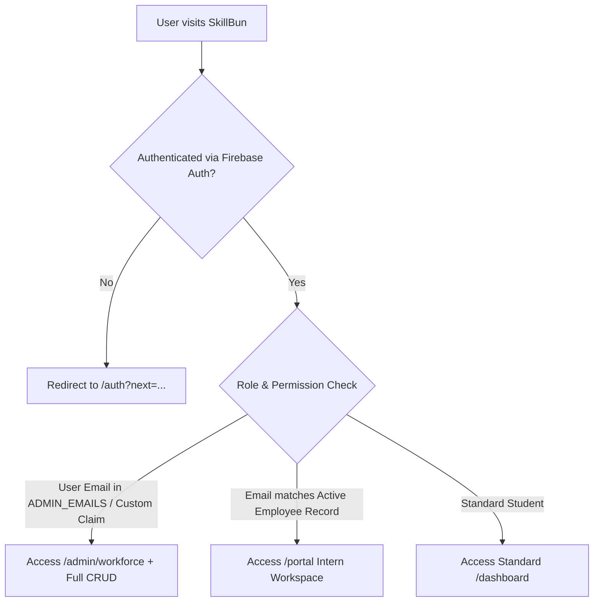
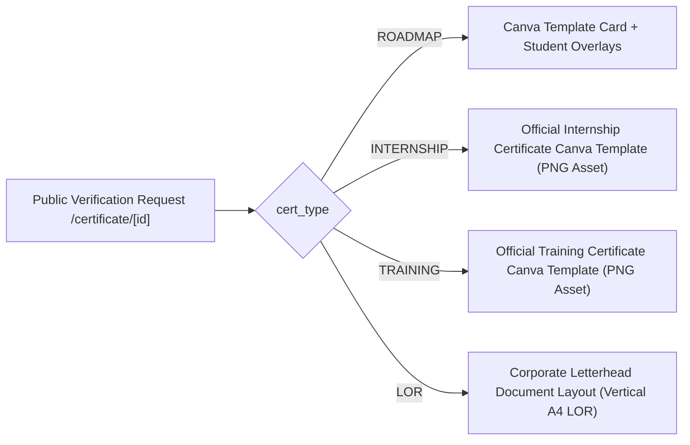
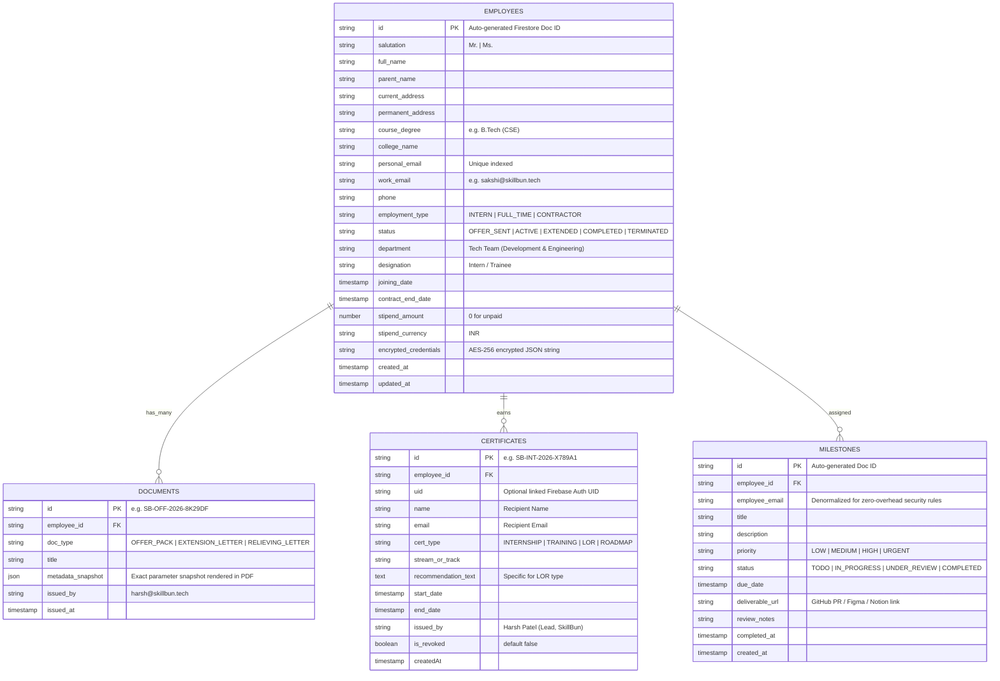
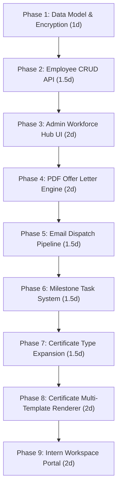

# Product Requirements Document (PRD)

**Product Module:** SkillBun Workforce Hub & Credentials Engine  
**Document Version:** v1.2 (Approved for Engineering Execution)  
**Route Allocation:**  
- **Admin Workforce Hub:** `/admin/workforce`  
- **Intern Workspace:** `/portal` (or `/workspace`)  
- **Public Credential Verification:** `/certificate/[id]`  
**Target Version:** v1.0 (Production-Ready MVP)  
**Author:** Senior Product Manager (incorporating Founder & Lead Architecture Directives)  
**Parent Entity:** SkillBun  
**Status:** ✅ **APPROVED BY FOUNDER (HARSH PATEL)**  

---

## 1. Executive Summary & Problem Statement

### 1.1 The Core Problem
SkillBun’s team onboarding, legal documentation, intern credential management, and sprint task tracking currently suffer from administrative drag:
* **Manual Document Generation:** Manually drafting multi-page Word documents for the **4-Page Offer Letter & Terms of Engagement**, converting them to PDFs, and emailing them via individual Zoho threads (~30–45 mins per candidate).
* **Untracked Confirmations:** Chasing signed confirmation replies with zero centralized status logging.
* **Manual Exit Credentials:** Handcrafting and emailing completion certificates, training certificates, and Letters of Recommendation (LOR) upon tenure completion.
* **Scattered Task & Milestone Tracking:** Milestones scattered across WhatsApp/Slack, leading to missed deliverables and unmonitored contract expiration dates.

### 1.2 Who Benefits?
* **Harsh (Founder & Lead):** Drops onboarding and credential issuance time from **45 minutes to < 60 seconds** per candidate with automated tenure countdowns, 1-click offer generation, and tamper-proof credential issuance.
* **Interns & Team Members:** Receive immediate formal offer documentation, a centralized `/portal` for assigned Zoho workspace credentials and milestone deliverables, and permanent, publicly verifiable digital credentials (`/certificate/[id]`) with QR codes and 1-click LinkedIn profile integration.

---

## 2. Infrastructure Audit & Codebase Reuse

To prevent duplicate engineering work, this module strictly extends and reuses SkillBun's existing production infrastructure:

| Capability | Existing Codebase Asset | Integration & Extension Strategy |
| :--- | :--- | :--- |
| **Zoho SMTP Transport** | `utils/server/zohoMailer.js` | Reuse Nodemailer transporter configured for `smtppro.zoho.in:465` with connection pooling. Extend to support PDF buffer attachments (`attachments: [{ filename, content }]`). |
| **Email Template Engine** | `utils/server/retentionEmails.js`, `retentionTemplates.js` | Reuse dark/light responsive HTML email wrapper and dynamic token replacement (`{name}`, `{email}`, etc.) for the Offer Dispatch email. |
| **Admin Email API & Guards** | `app/api/admin/emails/send/route.js` | Reuse Firebase Admin ID Token verification, `isAuthorizedAdminEmail()` guard, anti-spam headers, and BCC confirmation to `harsh@skillbun.tech`. |
| **Public Certificate Verification** | `app/certificate/[id]/page.jsx`, `app/certificate/page.jsx` | Reuse existing Firestore `/certificates/{id}` query, QR code rendering, LinkedIn 1-click "Add to Profile" & "Share on Feed" modal, and browser print/PDF controls. |
| **Certificate Minting API** | `app/api/certify/mint/route.js` | Extend schema to support `cert_type: 'INTERNSHIP' \| 'TRAINING' \| 'LOR' \| 'ROADMAP'` with role-based issuance controls. |
| **Input Validation Framework** | `utils/server/inputValidator.js` | Reuse `validateSchema()`, `validateString()`, `validateEmail()` for all workforce API payloads. |
| **Rate Limiting Engine** | `utils/server/rateLimitStore.js` | Reuse multi-window IP and user rate limiting on offer generation and credential minting endpoints. |
| **Admin Role Definition** | `utils/server/env.js` | Reuse `isAuthorizedAdminEmail()` which checks the `ADMIN_EMAILS` environment variable (default `harsh@skillbun.tech`). |

---

## 3. Target Users & Personas

### Persona 1: The Founder & Lead Operator
* **Name:** Harsh Patel (Lead, SkillBun)
* **Workflow:**
  1. Add candidate in $< 60$ seconds with academic, personal, and role details.
  2. 1-click generate the exact **4-page formal Offer Letter & Terms of Engagement** PDF via `pdf-lib`.
  3. 1-click email dispatch from `noreply@skillbun.tech` with `harsh@skillbun.tech` in CC/Reply-To and attached PDF.
  4. Assign sprint milestones, track tenure countdowns with amber alerts ($\le 10$ days), and 1-click issue **Extension Letters**, **Certificates of Internship**, **Certificates of Training**, and **LORs**.

### Persona 2: The Intern / Team Member
* **Name:** Sakshi Gupta (Tech Team / Engineering Intern)
* **Workflow:**
  1. Receive formal offer pack via email, review the terms, and reply back to `harsh@skillbun.tech` with the signed copy.
  2. Log in to `/portal` using standard SkillBun Google/Email authentication to view assigned Zoho credentials and sprint milestones.
  3. Update milestone progress and submit deliverable URLs (GitHub, Figma, Notion).
  4. Upon tenure completion, 1-click download official credentials and share the public verification link on LinkedIn.

---

## 4. Goals and Non-Goals

### 4.1 Goals (In Scope - MVP v1.0)
1. **Serverless 4-Page Offer Pack Generator:** Pixel-perfect programmatic rendering via `pdf-lib` matching the verified SkillBun Agreement layout.
2. **Automated Zoho Mail Pipeline:** Server-side dispatch with attached PDF, anti-spam headers, and CC to `harsh@skillbun.tech`.
3. **Admin Workforce Hub (`/admin/workforce`):** Candidate CRUD, status pipeline (`OFFER_SENT`, `ACTIVE`, `EXTENDED`, `COMPLETED`, `TERMINATED`), tenure countdown alerts, and 1-click credential issuance.
4. **Intern Self-Service Workspace (`/portal`):** Protected dashboard showing encrypted Zoho credentials (click-to-reveal), milestone checklist, and issued documents.
5. **Unified Multi-Type Credential Engine:** Dynamic verification at `/certificate/[id]` supporting **Roadmap**, **Internship**, **Training**, and vertical letterhead **LOR** formats.
6. **Dual-Role Navigation:** Seamless co-existence for users who are both SkillBun students and active interns.
7. **Zero Incremental Operating Cost:** Built entirely on existing Firebase Firestore, Zoho Mail, and serverless Node.js infrastructure.

### 4.2 Non-Goals (Out of Scope for MVP)
* **In-App Drawing Canvas Signatures:** Acceptance is handled via candidate email reply to `harsh@skillbun.tech` (legally valid, zero friction, no third-party signature SaaS needed).
* **Automated Zoho Directory API Provisioning:** Workspace accounts are manually created by Admin and entered into the encrypted credential card.
* **Full-Featured Kanban / Time-Tracking:** Tasks are structured as a clean milestone checklist with deliverable URLs.
* **External S3 / Cloudflare R2 File Bloat:** Certificates are rendered dynamically from Firestore data. Only generated offer PDFs are streamed or cached.
* **Runtime Gemini API Generation for LORs:** All LOR copy uses standardized, customizable corporate boilerplate in the Admin modal to comply with repository rules and conserve API quota.

---

## 5. System Architecture & Authentication Model

### 5.1 Authentication & Role-Based Access Control (RBAC)



1. **Authentication Provider:** Standard Firebase Auth (Google OAuth & Email/Password). Interns do not need a separate auth silo; their SkillBun account email links to their workforce record.
2. **Admin Authorization:** Protected by `isAuthorizedAdminEmail(user.email)` in `utils/server/env.js` and Firebase Auth Custom Claims (`request.auth.token.admin === true`).
3. **Intern Authorization:** When an authenticated user navigates to `/portal`, the serverless backend/client queries:
   ```javascript
   const employeeSnap = await db.collection('employees')
     .where('personal_email', '==', user.email.toLowerCase())
     .where('status', 'in', ['OFFER_SENT', 'ACTIVE', 'EXTENDED', 'COMPLETED'])
     .limit(1)
     .get();
   ```
   If found, access is granted to their workspace; if not, they are redirected to `/dashboard` with a notification.

4. **Dual-Role Navigation (Student + Intern):**
   * If a user is both an active intern and a SkillBun student:
     * The shared `UserMenu` displays links to both **"My Dashboard"** (`/dashboard`) and **"Intern Workspace"** (`/portal`).
     * Default post-login landing page for active interns defaults to `/portal` during their active tenure.
     * All earned roadmap certificates and workforce credentials coexist cleanly in the user's unified certificate history.

### 5.2 Credential Security & Encryption at Rest

To prevent storing plaintext passwords in Firestore:
* The `credentials_data` payload (`{ work_email, password, access_notes }`) is encrypted server-side using AES-256-GCM with a secret key (`WORKFORCE_ENCRYPTION_KEY` or fallback derived secret) before saving to Firestore under `encrypted_credentials`.
* The `/portal` API route decrypts the payload only when requested by the verified token owner (`uid` or matching `personal_email`).
* In the UI, passwords and access keys default to masked state (`••••••••••••`) with click-to-reveal and 1-click copy buttons.

---

## 6. Detailed Functional Specifications

### 6.1 Serverless 4-Page Offer Pack (`pdf-lib`)
The server-side generator uses `pdf-lib` to build a vector PDF with exact typography, margins, headers, and signature blocks:

```text
[Page 1]
- Header: SKILLBUN (Interactive Tech Career Ecosystem)
- Blue Accent Title: | INTERNSHIP OFFER LETTER & TERMS OF ENGAGEMENT
- To Block: 
    - [Salutation: Mr./Ms.] [Candidate Name] son/daughter of [Parent's Name]
    - Current Address: [Current Address]
    - Permanent Address: [Permanent Address]
    - Qualification: [Degree/Course, e.g., B.Tech (CSE)]
    - College: [Name of College/University]
- | BACKGROUND (SkillBun overview)
- | SELECTION AS INTERN (4-round screening: Resume, Intro Meet, Stream Q&A, Internal Review)
- | INTERNSHIP STATUS AND PURPOSE (1. Learning Experience, 2. Internship Not Employment, 3. Global Team Collaboration)

[Page 2]
- | INTERNSHIP PARTICIPATION AND RESPONSIBILITIES (1. Period: [Start Date] to [End Date], 2. Project Goals)
- | EFFICIENT TIME MANAGEMENT (Academic balance clause)
- | DUTIES (Stream: [Tech Team (Development & Engineering) / Product / Design], 6 core bullet points)
- | COMPLIANCE & | PROFESSIONAL CONDUCT
- | INTELLECTUAL PROPERTY AND NON-DISCLOSURE AGREEMENT (NDA) (1. Company IP, 2. Strict Confidentiality & Penalty)

[Page 3]
- | NDA Contd. (3. Content Ownership by SkillBun)
- | COMPENSATION, PERKS & PPO (1. Unpaid/Stipend status, 2. Assured Perks: Certificate of Internship, Training Certificate, LOR, 3. Pre-Placement Offer terms)
- | INTERNSHIP TERMINATION (SkillBun termination, Intern written notice, Effects)
- | LIMITATION OF LIABILITY & | DISCLAIMER OF WARRANTIES
- | GOVERNING LAW (Laws of India) & | ENTIRE AGREEMENT

[Page 4]
- IN WITNESS WHEREOF Execution Block
- For SkillBun: Name: Harsh Patel, Title: Lead, SkillBun + Official Signature & Seal Stamp
- For [Candidate Name]: Title: Intern + Signature Line
- Confidential Footer: SkillBun Internship Program • Confidential | Page X of 4
```

### 6.2 Reference ID & Credential ID Generation Strategy

All generated documents and credentials use unique, tamper-proof, non-sequential identifier strings:

| Document / Credential Type | ID Pattern | Example |
| :--- | :--- | :--- |
| **Offer Letter Reference** | `SB-OFF-YYYY-[6-CHAR-ALPHANUM]` | `SB-OFF-2026-8K29DF` |
| **Extension Letter Reference** | `SB-EXT-YYYY-[6-CHAR-ALPHANUM]` | `SB-EXT-2026-3N72LA` |
| **Certificate of Internship** | `SB-INT-YYYY-[6-CHAR-ALPHANUM]` | `SB-INT-2026-X789A1` |
| **Certificate of Training** | `SB-TRN-YYYY-[6-CHAR-ALPHANUM]` | `SB-TRN-2026-M452K9` |
| **Letter of Recommendation (LOR)** | `SB-LOR-YYYY-[6-CHAR-ALPHANUM]` | `SB-LOR-2026-P88102` |

### 6.3 Credential Template Formats (`/certificate/[id]`)

The public verification route dynamically selects the rendering engine based on `cert_type`:



1. **Internship & Training Certificates:** Rendered using Canva vector background PNG templates (`/internship-cert-template.png`, `/training-cert-template.png`) with dynamic typography (Cinzel recipient name, Pixelify track title, verification badge, and QR code).
2. **Letter of Recommendation (LOR):** Rendered as an official **Corporate Letterhead Document (A4 Vertical)** featuring:
   - Official SkillBun letterhead banner.
   - Formal salutation: *"TO WHOMSOEVER IT MAY CONCERN"*.
   - Dynamic recommendation body praising specific stream contributions and tenure (pre-filled with professional boilerplate in Admin modal, fully editable by Harsh before issuance).
   - Official seal stamp and signature of Harsh Patel (Lead, SkillBun).
   - Tamper-proof verification footer with dynamic registry URL.

---

## 7. Data Models & Firestore Schema

### 7.1 Entity Relationship Diagram



### 7.2 Firestore Security Rules Blueprint

```javascript
rules_version = '2';
service cloud.firestore {
  match /databases/{database}/documents {
    
    function isAdmin() {
      return request.auth != null && 
        (request.auth.token.admin == true || 
         request.auth.token.email == 'harsh@skillbun.tech' ||
         request.auth.token.email in ['harsh@skillbun.tech']);
    }

    function isEmployeeOwner(email) {
      return request.auth != null && request.auth.token.email.lower() == email.lower();
    }

    // Employees Collection: Admin full access; Intern read-only on their own record
    match /employees/{employeeId} {
      allow read: if isAdmin() || (request.auth != null && request.auth.token.email.lower() == resource.data.personal_email.lower());
      allow write: if isAdmin();
    }

    // Milestones Collection: Admin full CRUD; Intern can update status & deliverable_url on assigned tasks
    match /milestones/{milestoneId} {
      allow read: if isAdmin() || (request.auth != null && request.auth.token.email.lower() == resource.data.employee_email.lower());
      allow create, delete: if isAdmin();
      allow update: if isAdmin() || (
        request.auth != null && 
        request.auth.token.email.lower() == resource.data.employee_email.lower() &&
        request.resource.data.diff(resource.data).affectedKeys().hasOnly(['status', 'deliverable_url', 'updated_at'])
      );
    }

    // Certificates Collection: Publicly readable for verification; Write restricted to Admin
    match /certificates/{certId} {
      allow read: if true;
      allow write: if isAdmin();
    }
  }
}
```

---

## 8. Edge Cases, Failure Handling & Security

| Scenario | Risk / Failure Mode | Mitigation & Handling |
| :--- | :--- | :--- |
| **Zoho SMTP Timeout or Outage** | Offer email fails to dispatch. | Catch SMTP error $\rightarrow$ mark status as `DISPATCH_FAILED` $\rightarrow$ provide admin with an instant **"Download PDF Manually"** button and pre-filled email draft to copy. |
| **Plaintext Credential Theft** | Database compromise exposes intern credentials. | All workspace passwords stored as AES-256-GCM ciphertext. Decrypted only on verified token request. |
| **Expiring Intern Contracts** | Intern contract ends without renewal or exit review. | Admin hub prominently displays amber countdown badges for all contracts expiring within $\le 10$ days. |
| **Premature Termination** | Intern leaves before completing tenure. | Admin clicks `Mark Terminated` $\rightarrow$ immediately disables credential access in `/portal` and blocks 1-click issuance of completion certificates. |
| **Forged LOR or Certificate** | External party fabricates an offer/LOR. | Public `/certificate/[id]` registry displays cryptographic validation badges; invalid IDs display clear error cards. |

---

## 9. Success Metrics & ROI

* **Time-to-Offer:** Drops from **45 minutes $\rightarrow < 60$ seconds** (Enter form $\rightarrow$ 1-click PDF generation + email dispatch).
* **Time-to-Certify & LOR:** Drops from **25 minutes $\rightarrow 10$ seconds** per completing intern.
* **Zero Missed Contract Expirations:** 100% of expiring contracts flagged in advance via automated amber dashboard countdowns.
* **Zero Incremental Cost:** Total infrastructure cost remains **$0.00 / month** by leveraging existing Zoho SMTP, Firebase Firestore.

## 10. Phased Engineering Execution Blueprint

Each phase is scoped for **1 engineer** working sequentially. Every phase has its own detailed specification with a verification checklist — linked below.



| Phase | Scope | Effort | Status | Spec Document |
|:---|:---|:---|:---:|:---|
| **Phase 1** | Firestore schema, security rules, AES-256 encryption helper, ID generator | ~1 day | ✅ **Completed** | [PHASE_1_DATA_MODEL.md](./phases/PHASE_1_DATA_MODEL.md) |
| **Phase 2** | Employee CRUD API (GET/POST/PATCH/DELETE) with validation & rate limiting | ~1.5 days | ✅ **Completed** | [PHASE_2_EMPLOYEE_CRUD_API.md](./phases/PHASE_2_EMPLOYEE_CRUD_API.md) |
| **Phase 3** | `/admin/workforce` UI — employee table, status tabs, add/edit modals, tenure countdown | ~2 days | ✅ **Completed** | [PHASE_3_ADMIN_UI.md](./phases/PHASE_3_ADMIN_UI.md) |
| **Phase 4** | Install `pdf-lib`, build 4-page offer letter & 1-page extension letter generators | ~2 days | ✅ **Completed** | [PHASE_4_PDF_ENGINE.md](./phases/PHASE_4_PDF_ENGINE.md) |
| **Phase 5** | Extend Zoho mailer for attachments, offer dispatch API, SMTP fallback | ~1.5 days | ✅ **Completed** | [PHASE_5_EMAIL_DISPATCH.md](./phases/PHASE_5_EMAIL_DISPATCH.md) |
| **Phase 6** | Milestone CRUD API + admin milestone panel in workforce hub | ~1.5 days | ✅ **Completed** | [PHASE_6_MILESTONES.md](./phases/PHASE_6_MILESTONES.md) |
| **Phase 7** | Extend cert minting API for INTERNSHIP/TRAINING/LOR + admin issuance modals | ~1.5 days | ✅ **Completed** | [PHASE_7_CERT_EXPANSION.md](./phases/PHASE_7_CERT_EXPANSION.md) |
| **Phase 8** | Update `/certificate/[id]` for 4 cert types + LOR letterhead + revoked handling | ~2 days | ✅ **Completed** | [PHASE_8_CERT_RENDERER.md](./phases/PHASE_8_CERT_RENDERER.md) |
| **Phase 9** | `/portal` intern workspace — credentials, milestones, documents, dual-role nav | ~2 days | ✅ **Completed** | [PHASE_9_INTERN_PORTAL.md](./phases/PHASE_9_INTERN_PORTAL.md) |

> **Live Progress Tracker:** Track the active engineering status, verification checklist, and implementation deliverables for all 9 phases in [PRD_COMPLETE_PROGRESS.md](./PRD_COMPLETE_PROGRESS.md).

> **Design Dependency:** Phase 8 requires Canva PNG templates for Internship and Training certificates (`public/internship-cert-template.png`, `public/training-cert-template.png`). These must be ready before Phase 8 begins.

---
**Total Estimated Net-New Engineering Effort:** **~15 working days / 3 weeks (1 Full-Stack Engineer)**
