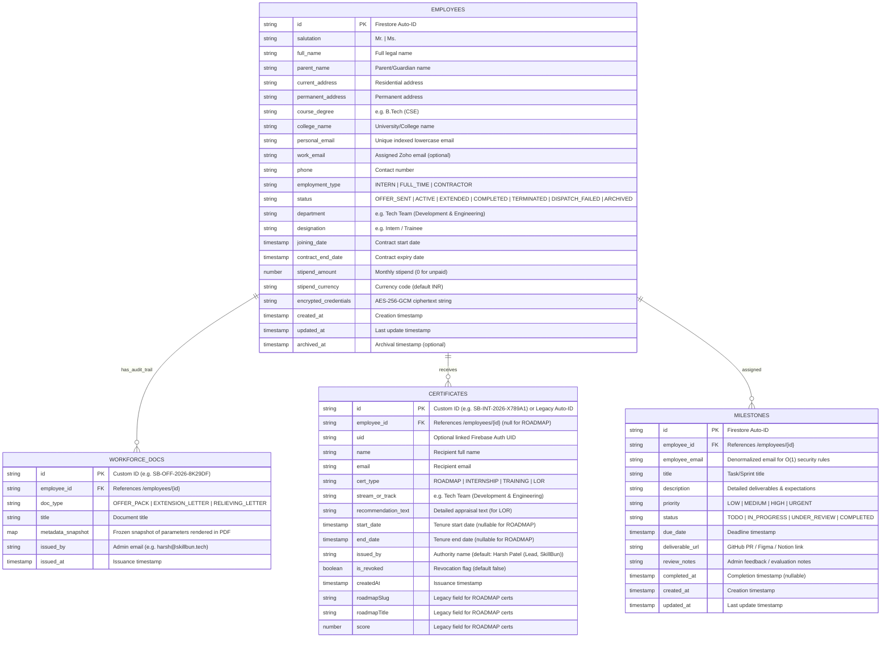
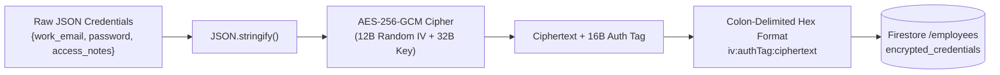

# Phase 1: Firestore Data Model, Security Rules & Credential Encryption Engine

**Parent PRD:** [PRD_WORKFORCE_MANAGEMENT.md](../PRD_WORKFORCE_MANAGEMENT.md)  
**Previous Phase:** None (Foundational Layer)  
**Next Phase:** [Phase 2 → Employee CRUD API](./PHASE_2_EMPLOYEE_CRUD_API.md)  
**Effort:** ~1 Working Day (1 Full-Stack Engineer)  
**Status:** ✅ Completed  
**Target Module:** SkillBun Workforce Hub & Credentials Engine  

---

## 1. Objective & Scope

Establish the complete database architecture, cryptographic subsystems, identifier generation utilities, compound index definitions, and Firestore security rules required for the SkillBun Workforce Management & Credential Hub. 

This phase delivers the foundational data and security layer without introducing UI routes or public endpoints, guaranteeing that subsequent phases (Phase 2 Employee CRUD, Phase 4 PDF Generator, Phase 5 Email Dispatch, Phase 6 Milestones, Phase 7/8 Multi-Type Credentials, and Phase 9 Intern Workspace) build upon a strictly typed, tamper-proof, and high-performance foundation.

### Key Deliverables in This Phase:
1. **Firestore Entity Schemas:** Define models for `/employees`, `/milestones`, `/workforce_docs`, and the extended `/certificates` collections.
2. **Cryptographic Engine (`utils/server/workforceCrypto.js`):** Production-grade AES-256-GCM authenticated encryption/decryption module for sensitive workspace credentials.
3. **Reference & Credential ID Generator (`utils/server/workforceId.js`):** Standardized, non-sequential, collision-resistant identifier generator (`SB-OFF-...`, `SB-EXT-...`, `SB-INT-...`, `SB-TRN-...`, `SB-LOR-...`).
4. **Firestore Security Rules (`firestore.rules`):** Role-based access control protecting admin operations, intern self-service access, and public certificate verification.
5. **Firestore Compound Index Blueprint (`firestore.indexes.json`):** Composite queries for contract expiration countdowns, status pipelines, and assigned milestone boards.
6. **Environment Configuration (`utils/server/env.js` & `.env.example`):** Configuration accessors for `WORKFORCE_ENCRYPTION_KEY`.

---

## 2. Firestore Collection Schemas & Entity Definitions

### 2.1 Entity Relationship Diagram



---

### 2.2 Collection Specifications

#### Collection A: `/employees`
Stores comprehensive records for all interns, contractors, and full-time team members.

| Field Name | Type | Nullable | Description / Constraints | Indexing |
| :--- | :--- | :---: | :--- | :--- |
| `id` | `string` | No | Auto-generated Firestore Document ID. | Primary Key |
| `salutation` | `string` | No | Enum: `'Mr.' \| 'Ms.'`. | — |
| `full_name` | `string` | No | Full legal name of candidate (2–100 chars). | Single Field |
| `parent_name` | `string` | No | Parent or legal guardian name (2–100 chars). | — |
| `current_address` | `string` | No | Current correspondence address (max 300 chars). | — |
| `permanent_address` | `string` | No | Permanent residential address (max 300 chars). | — |
| `course_degree` | `string` | No | Academic qualification, e.g. `'B.Tech (CSE)'`. | — |
| `college_name` | `string` | No | Name of University/College (max 150 chars). | — |
| `personal_email` | `string` | No | Lowercase personal email. Must be unique across active records. | Unique Single Field |
| `work_email` | `string` | Yes | Assigned corporate Zoho email, e.g. `'sakshi@skillbun.tech'`. | Single Field |
| `phone` | `string` | No | Contact telephone/WhatsApp number. | — |
| `employment_type` | `string` | No | Enum: `'INTERN' \| 'FULL_TIME' \| 'CONTRACTOR'`. Default `'INTERN'`. | Single Field |
| `status` | `string` | No | Enum: `'OFFER_SENT' \| 'ACTIVE' \| 'EXTENDED' \| 'COMPLETED' \| 'TERMINATED' \| 'DISPATCH_FAILED' \| 'ARCHIVED'`. `DISPATCH_FAILED` records a recoverable offer-dispatch failure per the PRD. | Composite Index |
| `department` | `string` | No | e.g. `'Tech Team (Development & Engineering)'`, `'Product'`, `'Design'`. | Composite Index |
| `designation` | `string` | No | Role designation, e.g. `'Full Stack Engineering Intern'`. | — |
| `joining_date` | `timestamp` | No | Official contract start date. | — |
| `contract_end_date` | `timestamp` | No | Official contract expiration date (used for $\le 10$-day tenure alerts). | Composite Index |
| `stipend_amount` | `number` | No | Monthly compensation amount (0 for unpaid). Default `0`. | — |
| `stipend_currency` | `string` | No | ISO currency code. Default `'INR'`. | — |
| `encrypted_credentials`| `string` | Yes | AES-256-GCM ciphertext of JSON `{ work_email, password, access_notes }`. | — |
| `created_at` | `timestamp` | No | Server timestamp of document creation. | — |
| `updated_at` | `timestamp` | No | Server timestamp of last document modification. | — |
| `archived_at` | `timestamp` | Yes | Timestamp of soft-deletion (status = `'ARCHIVED'`). | — |

**Sample Document (`/employees/emp_9a8f7c1d`):**
```json
{
  "id": "emp_9a8f7c1d",
  "salutation": "Ms.",
  "full_name": "Sakshi Gupta",
  "parent_name": "Rajesh Gupta",
  "current_address": "Flat 402, Sunshine Apts, Sector 62, Noida, UP - 201309",
  "permanent_address": "House 12, Civil Lines, Kanpur, UP - 208001",
  "course_degree": "B.Tech (Computer Science & Engineering)",
  "college_name": "Dr. A.P.J. Abdul Kalam Technical University",
  "personal_email": "sakshi.gupta@example.com",
  "work_email": "sakshi@skillbun.tech",
  "phone": "+91 9876543210",
  "employment_type": "INTERN",
  "status": "ACTIVE",
  "department": "Tech Team (Development & Engineering)",
  "designation": "Full Stack Engineering Intern",
  "joining_date": "2026-06-01T00:00:00.000Z",
  "contract_end_date": "2026-08-31T23:59:59.000Z",
  "stipend_amount": 0,
  "stipend_currency": "INR",
  "encrypted_credentials": "9b12a8...:4f3c...:88de1a...",
  "created_at": "2026-05-28T14:30:00.000Z",
  "updated_at": "2026-06-01T09:00:00.000Z",
  "archived_at": null
}
```

---

#### Collection B: `/milestones`
Tracks actionable sprint tasks, assignments, deliverable links, and review notes.

| Field Name | Type | Nullable | Description / Constraints | Indexing |
| :--- | :--- | :---: | :--- | :--- |
| `id` | `string` | No | Auto-generated Firestore Document ID. | Primary Key |
| `employee_id` | `string` | No | Foreign key referencing `/employees/{id}`. | Composite Index |
| `employee_email` | `string` | No | Denormalized lowercase personal email for zero-overhead security rules. | Composite Index |
| `title` | `string` | No | Task headline (3–200 chars). | — |
| `description` | `string` | Yes | Scope of work, technical requirements, guidelines. | — |
| `priority` | `string` | No | Enum: `'LOW' \| 'MEDIUM' \| 'HIGH' \| 'URGENT'`. Default `'MEDIUM'`. | — |
| `status` | `string` | No | Enum: `'TODO' \| 'IN_PROGRESS' \| 'UNDER_REVIEW' \| 'COMPLETED'`. | Composite Index |
| `due_date` | `timestamp` | No | Target milestone completion deadline. | — |
| `deliverable_url` | `string` | Yes | Link to GitHub PR, Figma canvas, Notion doc, or Loom demo. | — |
| `review_notes` | `string` | Yes | Read-only evaluation feedback from Harsh / Admin. | — |
| `completed_at` | `timestamp` | Yes | Timestamp when status transitioned to `'COMPLETED'`. | — |
| `created_at` | `timestamp` | No | Server creation timestamp. | Composite Index |
| `updated_at` | `timestamp` | No | Server modification timestamp. | — |

**Sample Document (`/milestones/ms_3k4j5l6m`):**
```json
{
  "id": "ms_3k4j5l6m",
  "employee_id": "emp_9a8f7c1d",
  "employee_email": "sakshi.gupta@example.com",
  "title": "Build Dark/Light Responsive Email Templates",
  "description": "Implement mobile-responsive HTML templates for Zoho mailer with dark mode CSS and token substitution.",
  "priority": "HIGH",
  "status": "IN_PROGRESS",
  "due_date": "2026-06-15T18:00:00.000Z",
  "deliverable_url": "https://github.com/skillbun/skillbun/pull/142",
  "review_notes": "Great progress on typography. Please ensure fallback fonts work on Outlook.",
  "completed_at": null,
  "created_at": "2026-06-02T10:00:00.000Z",
  "updated_at": "2026-06-08T16:20:00.000Z"
}
```

---

#### Collection C: `/workforce_docs`
Provides an immutable audit log of all formal legal documents generated and dispatched.

| Field Name | Type | Nullable | Description / Constraints | Indexing |
| :--- | :--- | :---: | :--- | :--- |
| `id` | `string` | No | Unique Reference ID (e.g. `'SB-OFF-2026-8K29DF'`, `'SB-EXT-2026-3N72LA'`). | Primary Key |
| `employee_id` | `string` | No | Foreign key referencing `/employees/{id}`. | Composite Index |
| `doc_type` | `string` | No | Enum: `'OFFER_PACK' \| 'EXTENSION_LETTER' \| 'RELIEVING_LETTER'`. | Single Field |
| `title` | `string` | No | Human-readable title, e.g. `'Internship Offer Letter & Terms of Engagement'`. | — |
| `metadata_snapshot`| `map` | No | Immutable snapshot of exact candidate & role data embedded in the PDF. | — |
| `issued_by` | `string` | No | Admin issuer email (default `'harsh@skillbun.tech'`). | — |
| `issued_at` | `timestamp` | No | Server timestamp of document issuance. | Composite Index |

**Sample Document (`/workforce_docs/SB-OFF-2026-8K29DF`):**
```json
{
  "id": "SB-OFF-2026-8K29DF",
  "employee_id": "emp_9a8f7c1d",
  "doc_type": "OFFER_PACK",
  "title": "Internship Offer Letter & Terms of Engagement",
  "metadata_snapshot": {
    "reference_id": "SB-OFF-2026-8K29DF",
    "salutation": "Ms.",
    "full_name": "Sakshi Gupta",
    "parent_name": "Rajesh Gupta",
    "current_address": "Flat 402, Sunshine Apts, Sector 62, Noida, UP - 201309",
    "permanent_address": "House 12, Civil Lines, Kanpur, UP - 208001",
    "course_degree": "B.Tech (Computer Science & Engineering)",
    "college_name": "Dr. A.P.J. Abdul Kalam Technical University",
    "personal_email": "sakshi.gupta@example.com",
    "department": "Tech Team (Development & Engineering)",
    "designation": "Full Stack Engineering Intern",
    "joining_date": "2026-06-01",
    "contract_end_date": "2026-08-31",
    "stipend_amount": 0,
    "stipend_currency": "INR",
    "signatory_name": "Harsh Patel",
    "signatory_title": "Lead, SkillBun"
  },
  "issued_by": "harsh@skillbun.tech",
  "issued_at": "2026-05-28T14:35:00.000Z"
}
```

---

#### Collection D: `/certificates` (Extended Unified Registry)
Preserves 100% backward compatibility with existing SkillBun Roadmap certificates while extending schema to support Internship, Training, and Letter of Recommendation (LOR) credentials.

| Field Name | Type | Nullable | Description / Constraints | Indexing |
| :--- | :--- | :---: | :--- | :--- |
| `id` | `string` | No | Custom ID (`SB-INT-...`, `SB-TRN-...`, `SB-LOR-...`) or Legacy Auto-ID. | Primary Key |
| `cert_type` | `string` | No | Enum: `'ROADMAP' \| 'INTERNSHIP' \| 'TRAINING' \| 'LOR'`. Default `'ROADMAP'`. | Composite Index |
| `employee_id` | `string` | Yes | Foreign key to `/employees/{id}` (null for self-minted `'ROADMAP'` certs). | Composite Index |
| `uid` | `string` | Yes | Firebase Auth UID of recipient (optional). | Single Field |
| `name` | `string` | No | Recipient full name as displayed on certificate/letterhead. | — |
| `email` | `string` | No | Recipient email address. | Composite Index |
| `stream_or_track` | `string` | Yes | Track name, e.g. `'Tech Team (Development & Engineering)'`. | — |
| `recommendation_text` | `string` | Yes | Detailed appraisal body (mandatory for `'LOR'` type). | — |
| `start_date` | `timestamp` | Yes | Tenure start date (used on workforce certificates and LORs). | — |
| `end_date` | `timestamp` | Yes | Tenure completion date. | — |
| `issued_by` | `string` | No | Issuing authority. Default: `'Harsh Patel (Lead, SkillBun)'`. | — |
| `is_revoked` | `boolean` | No | Security flag to immediately invalidate compromised credentials. Default `false`. | Single Field |
| `createdAt` | `timestamp` | No | Timestamp of issuance. | Composite Index |
| `roadmapSlug` | `string` | Yes | Legacy field: Slug of completed roadmap (for `'ROADMAP'` type). | — |
| `roadmapTitle` | `string` | Yes | Legacy field: Display title of roadmap (for `'ROADMAP'` type). | — |
| `score` | `number` | Yes | Legacy field: Certification exam score percentage (for `'ROADMAP'` type). | — |

**Sample Document 1: Certificate of Internship (`/certificates/SB-INT-2026-X789A1`):**
```json
{
  "id": "SB-INT-2026-X789A1",
  "cert_type": "INTERNSHIP",
  "employee_id": "emp_9a8f7c1d",
  "uid": "usr_firebase_auth_uid_123",
  "name": "Sakshi Gupta",
  "email": "sakshi.gupta@example.com",
  "stream_or_track": "Tech Team (Development & Engineering)",
  "recommendation_text": null,
  "start_date": "2026-06-01T00:00:00.000Z",
  "end_date": "2026-08-31T23:59:59.000Z",
  "issued_by": "Harsh Patel (Lead, SkillBun)",
  "is_revoked": false,
  "createdAt": "2026-08-31T18:00:00.000Z"
}
```

**Sample Document 2: Letter of Recommendation (`/certificates/SB-LOR-2026-P88102`):**
```json
{
  "id": "SB-LOR-2026-P88102",
  "cert_type": "LOR",
  "employee_id": "emp_9a8f7c1d",
  "uid": "usr_firebase_auth_uid_123",
  "name": "Sakshi Gupta",
  "email": "sakshi.gupta@example.com",
  "stream_or_track": "Tech Team (Development & Engineering)",
  "recommendation_text": "Sakshi demonstrated outstanding engineering competence during her tenure with SkillBun. She contributed substantially to our core platforms, demonstrating mastery in Next.js, Node.js, and system architecture...",
  "start_date": "2026-06-01T00:00:00.000Z",
  "end_date": "2026-08-31T23:59:59.000Z",
  "issued_by": "Harsh Patel (Lead, SkillBun)",
  "is_revoked": false,
  "createdAt": "2026-08-31T18:05:00.000Z"
}
```

---

## 3. Cryptographic Engine Specification (`workforceCrypto.js`)

To comply with zero-trust database design and prevent exposure of intern workspace credentials in the event of database snapshot leaks, sensitive account credentials (`{ work_email, password, access_notes }`) are encrypted server-side using **AES-256-GCM** authenticated encryption before storage.

### 3.1 Cryptographic Architecture
* **Algorithm:** `AES-256-GCM` (Advanced Encryption Standard in Galois/Counter Mode).
* **Key Derivation & Length:** Exactly 32 bytes (256 bits). Sourced via `WORKFORCE_ENCRYPTION_KEY` environment variable (represented as a 64-character hexadecimal string).
* **Initialization Vector (IV):** 12 bytes (96 bits) of cryptographically secure pseudorandom data (`crypto.randomBytes(12)`) generated fresh for **every single encryption operation**. Never reused.
* **Authentication Tag:** 16 bytes (128 bits) generated by GCM (`cipher.getAuthTag()`). Ensures ciphertext integrity and protects against bit-flipping / tampering attacks.
* **Wire / Serialization Format:** Compact colon-delimited hexadecimal string:
  $$\text{Payload} = \text{iv\_hex} + \text{":"} + \text{auth\_tag\_hex} + \text{":"} + \text{ciphertext\_hex}$$



---

### 3.2 Reference Implementation Code: `utils/server/workforceCrypto.js`

```javascript
import crypto from 'node:crypto';
import { getWorkforceEncryptionKey } from '@/utils/server/env';

const ALGORITHM = 'aes-256-gcm';
const IV_LENGTH = 12; // 96 bits for GCM
const AUTH_TAG_LENGTH = 16; // 128 bits

/**
 * Validates and retrieves the 32-byte Buffer key from the environment.
 * Throws explicit errors to prevent silent data corruption or unencrypted storage.
 * @returns {Buffer}
 */
function getEncryptionKeyBuffer() {
  const rawKey = getWorkforceEncryptionKey();

  if (!rawKey || typeof rawKey !== 'string') {
    throw new Error('WORKFORCE_ENCRYPTION_KEY is not configured in server environment.');
  }

  const trimmed = rawKey.trim();

  // Support 64-character hex string (32 bytes)
  if (/^[0-9a-fA-F]{64}$/.test(trimmed)) {
    return Buffer.from(trimmed, 'hex');
  }

  // Support raw 32-character utf8 string
  if (Buffer.byteLength(trimmed, 'utf8') === 32) {
    return Buffer.from(trimmed, 'utf8');
  }

  throw new Error(
    'WORKFORCE_ENCRYPTION_KEY must be a 64-character hex string or 32-byte UTF-8 string.'
  );
}

/**
 * Encrypts an object containing sensitive credentials into an authenticated ciphertext string.
 * @param {Object} data - Credential payload, e.g. { work_email, password, access_notes }
 * @returns {string} Colon-delimited format: "ivHex:authTagHex:ciphertextHex"
 */
export function encryptCredentials(data) {
  if (!data || typeof data !== 'object') {
    throw new TypeError('encryptCredentials requires a non-null object payload.');
  }

  const keyBuffer = getEncryptionKeyBuffer();
  const iv = crypto.randomBytes(IV_LENGTH);
  const plaintext = JSON.stringify(data);

  const cipher = crypto.createCipheriv(ALGORITHM, keyBuffer, iv);
  let ciphertext = cipher.update(plaintext, 'utf8', 'hex');
  ciphertext += cipher.final('hex');

  const authTag = cipher.getAuthTag();

  return `${iv.toString('hex')}:${authTag.toString('hex')}:${ciphertext}`;
}

/**
 * Decrypts a colon-delimited AES-256-GCM ciphertext string back to the original object.
 * @param {string} encryptedString - "ivHex:authTagHex:ciphertextHex"
 * @returns {Object} Original decrypted credential payload
 */
export function decryptCredentials(encryptedString) {
  if (typeof encryptedString !== 'string' || !encryptedString.includes(':')) {
    throw new TypeError('Invalid encrypted credentials format. Expected "iv:authTag:ciphertext".');
  }

  const parts = encryptedString.split(':');
  if (parts.length !== 3) {
    throw new Error('Malformed ciphertext structure. Expected exactly 3 delimited components.');
  }

  const [ivHex, authTagHex, ciphertextHex] = parts;

  const iv = Buffer.from(ivHex, 'hex');
  const authTag = Buffer.from(authTagHex, 'hex');

  if (iv.length !== IV_LENGTH) {
    throw new Error(`Invalid IV length: expected ${IV_LENGTH} bytes, got ${iv.length}.`);
  }

  if (authTag.length !== AUTH_TAG_LENGTH) {
    throw new Error(`Invalid Auth Tag length: expected ${AUTH_TAG_LENGTH} bytes, got ${authTag.length}.`);
  }

  const keyBuffer = getEncryptionKeyBuffer();
  const decipher = crypto.createDecipheriv(ALGORITHM, keyBuffer, iv);
  decipher.setAuthTag(authTag);

  let decrypted = decipher.update(ciphertextHex, 'hex', 'utf8');
  decrypted += decipher.final('utf8');

  return JSON.parse(decrypted);
}
```

---

## 4. Reference & Credential ID Generator (`workforceId.js`)

All generated legal letters and credentials must feature human-readable, non-sequential, tamper-resistant reference codes matching PRD Section 6.2.

### 4.1 ID Format Specifications

| Prefix | Category | Pattern | Output Example |
| :--- | :--- | :--- | :--- |
| `SB-OFF` | 4-Page Offer Letter & Terms Pack | `SB-OFF-YYYY-[6-CHAR-ALPHANUM]` | `SB-OFF-2026-8K29DF` |
| `SB-EXT` | Extension Letter of Tenure | `SB-EXT-YYYY-[6-CHAR-ALPHANUM]` | `SB-EXT-2026-3N72LA` |
| `SB-INT` | Certificate of Internship | `SB-INT-YYYY-[6-CHAR-ALPHANUM]` | `SB-INT-2026-X789A1` |
| `SB-TRN` | Certificate of Training | `SB-TRN-YYYY-[6-CHAR-ALPHANUM]` | `SB-TRN-2026-M452K9` |
| `SB-LOR` | Letter of Recommendation (LOR) | `SB-LOR-YYYY-[6-CHAR-ALPHANUM]` | `SB-LOR-2026-P88102` |

---

### 4.2 Reference Implementation Code: `utils/server/workforceId.js`

```javascript
import crypto from 'node:crypto';

export const WORKFORCE_PREFIXES = Object.freeze({
  OFFER: 'SB-OFF',
  EXTENSION: 'SB-EXT',
  INTERNSHIP: 'SB-INT',
  TRAINING: 'SB-TRN',
  LOR: 'SB-LOR',
});

// Character pool excluding ambiguous characters (0, O, 1, I, L)
const CHARSET = '23456789ABCDEFGHJKMNPQRSTUVWXYZ';

/**
 * Generates a cryptographically random, non-sequential alphanumeric string of specified length.
 * @param {number} length
 * @returns {string}
 */
function getRandomAlphanumeric(length = 6) {
  const bytes = crypto.randomBytes(length);
  let result = '';
  for (let i = 0; i < length; i++) {
    result += CHARSET[bytes[i] % CHARSET.length];
  }
  return result;
}

/**
 * Generates a formatted workforce document or credential ID.
 * @param {'SB-OFF' | 'SB-EXT' | 'SB-INT' | 'SB-TRN' | 'SB-LOR'} prefix
 * @param {number} [customYear] - Optional override year (defaults to current UTC year)
 * @returns {string} e.g. "SB-OFF-2026-8K29DF"
 */
export function generateWorkforceId(prefix, customYear) {
  const validPrefixes = Object.values(WORKFORCE_PREFIXES);
  if (!validPrefixes.includes(prefix)) {
    throw new Error(`Invalid workforce ID prefix "${prefix}". Expected one of: ${validPrefixes.join(', ')}`);
  }

  const year = customYear && Number.isInteger(customYear) ? customYear : new Date().getUTCFullYear();
  const randomSuffix = getRandomAlphanumeric(6);

  return `${prefix}-${year}-${randomSuffix}`;
}

/**
 * Validates whether a given string is a valid workforce document or credential ID.
 * @param {string} id
 * @returns {boolean}
 */
export function isValidWorkforceId(id) {
  if (typeof id !== 'string') return false;
  const regex = /^SB-(OFF|EXT|INT|TRN|LOR)-\d{4}-[23456789ABCDEFGHJKMNPQRSTUVWXYZ]{6}$/;
  return regex.test(id);
}
```

---

## 5. Firestore Security Rules Specification (`firestore.rules`)

The security rules enforce strict role-based isolation at the database layer. All administrative operations require authentication by Harsh Patel or admin custom claims. Interns can read their own employee and document records and submit partial milestone updates, while the general public can only read issued certificates for verification.

### 5.1 Rules Blueprint to Deploy

```javascript
rules_version = '2';

service cloud.firestore {
  match /databases/{database}/documents {
    
    // --- Helper Functions ---
    
    function signedIn() {
      return request.auth != null;
    }

    function signedInAs(uid) {
      return signedIn() && request.auth.uid == uid;
    }

    function isAdmin() {
      return signedIn() && (
        request.auth.token.admin == true ||
        request.auth.token.email.lower() == 'harsh@skillbun.tech' ||
        request.auth.token.email.lower() in ['harsh@skillbun.tech', 'admin@skillbun.tech']
      );
    }

    function isEmployeeOwner(email) {
      return signedIn() && 
        request.auth.token.email != null &&
        request.auth.token.email.lower() == email.lower();
    }

    // --- Standard SkillBun User & Roadmap Progress Rules (Preserved) ---
    
    match /users/{uid} {
      allow read, delete: if signedInAs(uid);
      allow create, update: if signedInAs(uid);

      match /roadmapProgress/{slug} {
        allow read, delete: if signedInAs(uid);
        allow create, update: if signedInAs(uid);
      }

      match /quizAttempts/{slug} {
        allow read, delete: if signedInAs(uid);
        allow create, update: if signedInAs(uid);
      }
    }

    // --- Workforce Hub: Employees Collection ---
    // Admin has full CRUD. Interns can only read their own employee document.
    match /employees/{employeeId} {
      allow read: if isAdmin() || (
        signedIn() && 
        resource != null && 
        isEmployeeOwner(resource.data.personal_email)
      );
      allow write: if isAdmin();
    }

    // --- Workforce Hub: Milestones Collection ---
    // Admin has full CRUD. Interns can read their tasks and update ONLY status, deliverable_url, and updated_at.
    match /milestones/{milestoneId} {
      allow read: if isAdmin() || (
        signedIn() && 
        resource != null && 
        isEmployeeOwner(resource.data.employee_email)
      );
      allow create, delete: if isAdmin();
      allow update: if isAdmin() || (
        signedIn() &&
        resource != null &&
        isEmployeeOwner(resource.data.employee_email) &&
        request.resource.data.diff(resource.data).affectedKeys().hasOnly(['status', 'deliverable_url', 'updated_at'])
      );
    }

    // --- Workforce Hub: Workforce Audit Documents Collection ---
    // Admin has full CRUD. Interns can read documents issued to their record.
    match /workforce_docs/{docId} {
      allow read: if isAdmin() || (
        signedIn() && 
        resource != null && 
        isEmployeeOwner(resource.data.metadata_snapshot.personal_email)
      );
      allow write: if isAdmin();
    }

    // --- Public Credentials Registry: Certificates Collection ---
    // Publicly readable for dynamic verification (/certificate/[id]).
    // Direct client writes are blocked — minting is executed server-side via Firebase Admin SDK.
    match /certificates/{certId} {
      allow read: if true;
      allow write: if false;
    }
  }
}
```

---

## 6. Firestore Compound Indexing Blueprint

To guarantee sub-100ms response times on the Admin Workforce Hub and Intern Portal, the following compound indexes must be deployed via `firestore.indexes.json` or configured in the Firebase Console:

```json
{
  "indexes": [
    {
      "collectionGroup": "employees",
      "queryScope": "COLLECTION",
      "fields": [
        { "fieldPath": "status", "order": "ASCENDING" },
        { "fieldPath": "contract_end_date", "order": "ASCENDING" }
      ]
    },
    {
      "collectionGroup": "employees",
      "queryScope": "COLLECTION",
      "fields": [
        { "fieldPath": "status", "order": "ASCENDING" },
        { "fieldPath": "department", "order": "ASCENDING" }
      ]
    },
    {
      "collectionGroup": "milestones",
      "queryScope": "COLLECTION",
      "fields": [
        { "fieldPath": "employee_id", "order": "ASCENDING" },
        { "fieldPath": "created_at", "order": "DESCENDING" }
      ]
    },
    {
      "collectionGroup": "milestones",
      "queryScope": "COLLECTION",
      "fields": [
        { "fieldPath": "employee_email", "order": "ASCENDING" },
        { "fieldPath": "status", "order": "ASCENDING" }
      ]
    },
    {
      "collectionGroup": "workforce_docs",
      "queryScope": "COLLECTION",
      "fields": [
        { "fieldPath": "employee_id", "order": "ASCENDING" },
        { "fieldPath": "issued_at", "order": "DESCENDING" }
      ]
    },
    {
      "collectionGroup": "certificates",
      "queryScope": "COLLECTION",
      "fields": [
        { "fieldPath": "employee_id", "order": "ASCENDING" },
        { "fieldPath": "createdAt", "order": "DESCENDING" }
      ]
    },
    {
      "collectionGroup": "certificates",
      "queryScope": "COLLECTION",
      "fields": [
        { "fieldPath": "email", "order": "ASCENDING" },
        { "fieldPath": "cert_type", "order": "ASCENDING" }
      ]
    }
  ],
  "fieldOverrides": []
}
```

---

## 7. Environment Variables & Accessor Helpers

### 7.1 `.env.example` Update
Add the following key to `.env.example`:

```bash
# Workforce credentials encryption key (AES-256, 64 hex chars = 32 bytes).
# Generate with: node -e "console.log(require('crypto').randomBytes(32).toString('hex'))"
WORKFORCE_ENCRYPTION_KEY=
```

### 7.2 `utils/server/env.js` Accessor
Export the safe accessor function:

```javascript
export function getWorkforceEncryptionKey() {
  return getFirstNonEmpty(process.env.WORKFORCE_ENCRYPTION_KEY);
}
```

---

## 8. Files Created / Modified Summary

| Action | File Path | Purpose |
| :--- | :--- | :--- |
| **NEW** | `utils/server/workforceCrypto.js` | AES-256-GCM encryption and decryption module for workspace credentials. |
| **NEW** | `utils/server/workforceId.js` | Cryptographic reference and credential ID generator utility. |
| **MODIFY** | `utils/server/env.js` | Added `getWorkforceEncryptionKey()` accessor function. |
| **MODIFY** | `firestore.rules` | Deployed role-based security rules for `/employees`, `/milestones`, `/workforce_docs`. |
| **MODIFY** | `.env.example` | Documented `WORKFORCE_ENCRYPTION_KEY` configuration. |
| **NEW/OPT** | `firestore.indexes.json` | Blueprint definition for composite Firestore queries. |

---

## 9. Proactive Operational & Security Guidelines

Per the repository's governance requirements in `AGENTS.md`:

> [!IMPORTANT]
> **Key Generation:** The `WORKFORCE_ENCRYPTION_KEY` must be generated once using a cryptographically secure random generator:
> ```bash
> node -e "console.log(require('crypto').randomBytes(32).toString('hex'))"
> ```
> Add the output to your local `.env` and production hosting environment (e.g. Vercel Project Settings). Never commit the actual key to Git.

> [!WARNING]
> **Key Rotation Considerations:** Because credentials stored in `/employees` are encrypted with this master key, changing `WORKFORCE_ENCRYPTION_KEY` in production requires a key-rotation script to re-encrypt existing records. Do not alter the key once production data exists without running a migration.

---

## 10. Verification & Acceptance Checklist

To verify Phase 1 completeness before advancing to Phase 2:

- [x] **V1.1 — Cryptographic Module Exports:** `utils/server/workforceCrypto.js` successfully exports `encryptCredentials(data)` and `decryptCredentials(ciphertext)`.
- [x] **V1.2 — Encryption Roundtrip Test:** Executing `encryptCredentials` followed by `decryptCredentials` returns an exact deep-equal match of `{ work_email, password, access_notes }`.
- [x] **V1.3 — Tamper Detection Test:** Modifying any character of the ciphertext or auth tag causes `decryptCredentials` to throw an authentication/decryption error rather than returning corrupt data.
- [x] **V1.4 — Missing Key Guard:** When `WORKFORCE_ENCRYPTION_KEY` is missing or invalid, functions throw descriptive errors immediately.
- [x] **V1.5 — ID Generation Format:** `generateWorkforceId('SB-OFF')`, `generateWorkforceId('SB-INT')`, etc. generate valid, formatted strings matching `isValidWorkforceId()`.
- [x] **V1.6 — Non-Sequential IDs:** 1,000 generated IDs produce 0 collisions and exhibit non-sequential random entropy.
- [x] **V1.7 — Security Rules Validation (Admin Access):** Authenticated admin user (`harsh@skillbun.tech` or `admin: true`) can perform CRUD on `/employees`, `/milestones`, `/workforce_docs`.
- [x] **V1.8 — Security Rules Validation (Intern Isolation):** Authenticated non-admin user can only read `/employees` and `/milestones` where their personal email matches, and cannot write to `/employees`.
- [x] **V1.9 — Security Rules Validation (Intern Task Updates):** Intern can update only `['status', 'deliverable_url', 'updated_at']` on assigned milestones; attempting to modify `title` or `due_date` is rejected by Firestore.
- [x] **V1.10 — Security Rules Validation (Public Verification):** Unauthenticated users can read `/certificates/{certId}` but cannot write to it.
- [x] **V1.11 — Backward Compatibility:** Existing `/certificates` documents with `ROADMAP` certs remain accessible and valid.
- [x] **V1.12 — Next.js Build Integrity:** Running `npm run lint` and build succeeds without errors.

---

**→ Once all checks pass, proceed to [Phase 2: Employee CRUD API Routes](./PHASE_2_EMPLOYEE_CRUD_API.md)**
