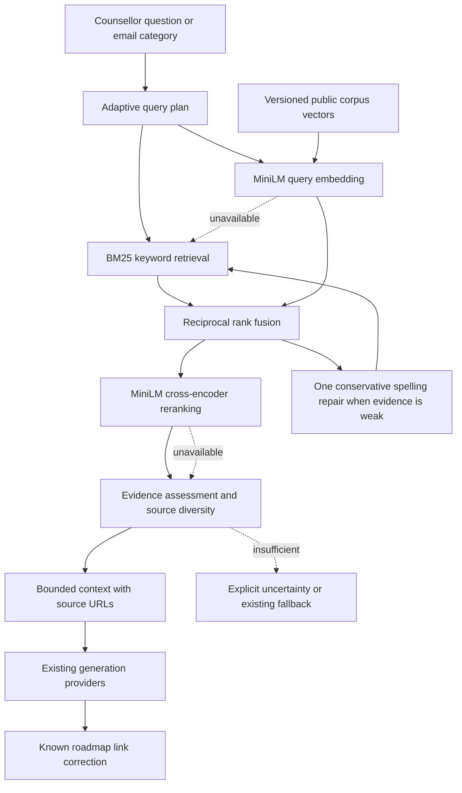

# Central SkillBun retrieval

The counsellor and AI email generator share `utils/server/rag/index.js`. The catalogue is read from public roadmap metadata; platform facts live in one allowlisted corpus module. A request retrieves evidence once and reuses it through the existing generation-provider fallback chain. This does not change the quiz engine, public search route, authentication, human verification, rate limits, saved email shape, or roadmap rendering.

## Decision

Three approaches were considered: lexical retrieval alone is inexpensive but misses semantic matches; a hosted vector database plus inference service adds operational setup for a small catalogue; local precomputed vectors with replaceable inference adapters provides real hybrid retrieval without requiring new credentials. The third option is the default. Explicit HTTP inference supports persistent production services without coupling callers to a vendor or database.



## Modules and contracts

| Module | Responsibility |
| --- | --- |
| `corpus.js` | Public-only extraction, deterministic IDs/content hash, tree and legacy formats, product facts, actual catalog count, partial-load handling and caching |
| `lexical.js` | Okapi BM25, technical tokens such as C++, C#, Node.js and .NET, reciprocal rank fusion |
| `models.js` | Real neural embeddings and paired-query/document cross-encoder; local/HTTP adapters, input validation, singletons, deadlines and failure cooldown |
| `vectors.js` | Load and validate the prepared corpus/model version; cosine retrieval; never embed the whole corpus in a request |
| `adaptive.js` | Greeting skip, focused/comparison/exploration budgets, limited English/Hinglish aliases, follow-up context, conservative typo correction and relevance gates |
| `index.js` | Orchestration, one correction attempt, fusion, reranking, diversity limits and bounded evidence formatting |
| `counsellor.js` | Extract actual user queries, keep synthetic profile prompts out of retrieval, optional existing web snippets, source rules and invalid roadmap-link correction |
| `emailDraftKnowledge.js` | Category-only queries and stricter reusable plain-text examples, at most three roadmaps and 1,800 characters |

`retrieveKnowledge({ query, history, purpose, timeoutMs })` returns `status`, `strategy`, `mode`, `corrections`, `sources`, `context`, `roadmapSlugs`, `roadmapCount` and `catalogComplete`. A source wraps the original allowlisted document and ranking signals. Status is `ready`, `degraded`, `insufficient` or `skipped`. These are internal server results; existing API response shapes remain unchanged.

## Retrieval and correction behavior

The current public corpus contains 100 roadmaps and 916 documents, including platform facts. File reads are capped at 1 MB, eight concurrent reads, two seconds overall and 1,200 documents. Five-minute caching avoids repeated work; failed refreshes retry sooner and may retain previous safe public documents. A partial catalogue is explicitly labelled incomplete, never advertised as a confirmed total. A redirected Windows workspace is resolved first, while individual catalogue symlinks and paths escaping its public directory are rejected.

BM25 and cosine results are fused by rank, not by adding incompatible raw scores. Focused questions consider 30 candidates per retriever and rerank at most 14; comparisons and exploration use 40 and 20. A source-diversity cap prevents one roadmap from filling the evidence window. The default retrieval deadline is six seconds; email retrieval uses 4.5 seconds within its existing generation deadline. Native inference can finish after a caller times out, but its slot stays occupied until it settles, so repeated requests cannot build an unbounded queue.

The cross-encoder jointly tokenizes each question and passage and runs `AutoModelForSequenceClassification`. It is not a cosine score relabelled as reranking. Its sigmoid score, BM25 score and normalized RRF score are ranking signals, not probabilities of correctness. Relevance thresholds are project heuristics evaluated against public smoke cases; they are not a trained confidence classifier.

Weak initial evidence permits one unambiguous one-edit spelling repair against the corpus vocabulary and another lexical search. A strongly negative cross-encoder score rejects superficial keyword overlap. Missing/stale vectors, unavailable inference, timeouts and malformed model output degrade to lexical retrieval and preserve the existing generation fallback. With insufficient evidence, the model is instructed to state uncertainty rather than invent platform facts. Generated SkillBun roadmap links are checked against the full loaded slug list; nonexistent destinations become the real `/roadmap` catalogue link. Partial catalogues do not rewrite links using an incomplete allowlist. This correction layer reduces known errors; it cannot prove every generated sentence is grounded.

The adaptive and corrective stages are bounded project-specific heuristics inspired by Adaptive-RAG/CRAG, not reproductions of their learned classifiers or full research pipelines. English is the strongest supported language for these MiniLM models. The limited Hinglish aliases improve common learning queries but do not establish general multilingual quality.

## Data boundaries

Only approved product facts and allowlisted public roadmap fields are indexed. No Firebase records, profile prompts, SBV1 files, decrypted study guides, assessment question banks, compensation fields, resource URLs or arbitrary request paths enter this corpus. Catalog strings are treated as reference data, never instructions. Personal queries are not written to a query cache or an index. The offline index script never uses `GEMINI_API_KEY` or another generative provider.

The counsellor retains its optional DuckDuckGo lookup for time-sensitive tech questions. It excludes profile context and strips common addresses/phone numbers from that search query. Search excerpts remain separate untrusted, potentially stale data; they are not imported into the local corpus or claimed to be verified facts. Local neural inference downloads model files but does not send the user's query to Hugging Face. HTTP mode sends queries/passages only to explicitly configured inference endpoints. Existing answer-generation providers continue receiving the normal conversation and selected evidence.

## Setup and deployment

The dependency is pinned to `@huggingface/transformers` 4.2.0. Node 22 remains the project's runtime requirement. Local defaults use `Xenova/all-MiniLM-L6-v2` for 384-dimensional normalized mean-pooled embeddings and `Xenova/ms-marco-MiniLM-L-6-v2` for reranking, both with `q8` weights on CPU. Their initial model download is cached outside the repository, in the operating system's temporary directory under `skillbun-rag-models` unless configured otherwise. Initial model loading can exceed a request budget; lexical results remain available while the models warm up.

```sh
npm ci
npm run rag:prepare
npm run rag:evaluate
npm run test:rag
```

`rag:prepare` downloads/loads the embedding model if needed, embeds only public documents in batches of eight, and atomically writes `content/rag/embeddings.json`. It refuses to replace an index with an incomplete catalogue. The prepared public index is a deployable source artifact; model binaries and temporary files are not committed. `rag:evaluate` warms both models and runs eight public synthetic cases, including technical identifiers, typos, Hinglish, semantic queries, comparisons, certification and an unrelated query. It checks retrieval results, not the correctness of generated AI answers.

Rebuild the index after public metadata/product-fact changes or an embedding-model change, and deploy the matching artifact with the code. Stale model/corpus signatures are rejected automatically. Next's route tracing includes public metadata and vectors for the counsellor and admin draft routes. Transformers.js and ONNX are automatically externalized by the installed Next version.

The production trace keeps ONNX native binaries for the build machine's OS/architecture and excludes other platforms plus the unused CUDA/TensorRT providers. Both models remain on the native CPU backend. The JavaScript imports, browser runtime package, CPU binding, shared runtime libraries, public corpus and vector index are retained. This prevents unused native binaries from exceeding Vercel's function-size limit without changing the RAG provider or requiring a new environment variable. Build on the same OS/architecture used to run the deployment, as with other native Node dependencies. The CI install step and Vercel install command set ONNX's supported `ONNXRUNTIME_NODE_INSTALL=skip` option: npm retains the bundled CPU runtime and skips the extra GPU-provider download during fresh installs. This build-only setting is committed in the workflow and `vercel.json`; no dashboard setting or credential is required.

| Environment variable | Default / meaning |
| --- | --- |
| `RAG_MODEL_PROVIDER` | `local`; explicit alternatives `http` or `lexical` |
| `RAG_MODEL_CACHE_DIR` | Optional writable persistent directory for local model files; default OS temp |
| `RAG_MODEL_TIMEOUT_MS` | Optional adapter default, 4,000 ms; the shared engine supplies tighter per-stage budgets |
| `RAG_EMBEDDING_URL` | HTTP mode only: full TEI-compatible `/embed` endpoint |
| `RAG_RERANK_URL` | HTTP mode only: full TEI-compatible `/rerank` endpoint |
| `RAG_EMBEDDING_MODEL_SIGNATURE` | Required in HTTP mode: operator-declared model/revision/pooling identity; changing it requires rebuilding vectors |
| `RAG_MODEL_API_KEY` | Optional bearer credential for the configured HTTP endpoints |

No new key is required for local mode. For a persistent Node deployment, provide a writable model cache and warm both models before traffic. For constrained/serverless deployment, configure separately hosted TEI embedding and reranking endpoints, or explicitly choose lexical-only mode. Remote embeddings must have 384 dimensions and match the model used to prepare the index. HTTP requires HTTPS except for loopback development endpoints, rejects URL credentials, and does not follow redirects. There is no automatic switch to an unconfigured remote service.

`node scripts/evaluate-rag.mjs --lexical` measures the degraded path independently; semantic-only matches can be weaker there. The unit suite uses injected model/service doubles and does not download models or send emails. Deployment-specific HTTP credentials, real inbox delivery and production load need validation in the destination environment.

## Primary references

- [Sentence Transformers retrieve and rerank](https://sbert.net/examples/sentence_transformer/applications/retrieve_rerank/README.html): two-stage retrieval and true cross-encoder ranking.
- [Transformers.js source](https://github.com/huggingface/transformers.js), [embedding model usage](https://huggingface.co/Xenova/all-MiniLM-L6-v2), [cross-encoder model usage](https://huggingface.co/Xenova/ms-marco-MiniLM-L-6-v2): the local neural implementation.
- [Elastic reciprocal rank fusion reference](https://www.elastic.co/docs/reference/elasticsearch/rest-apis/reciprocal-rank-fusion): rank-based fusion of lexical and semantic results.
- [Hugging Face TEI source](https://github.com/huggingface/text-embeddings-inference) and [API examples](https://huggingface.co/docs/text-embeddings-inference/quick_tour): optional HTTP embedding/reranking contracts.
- [Adaptive-RAG paper](https://arxiv.org/abs/2403.14403) and [CRAG authors' repository](https://github.com/HuskyInSalt/CRAG): adaptive retrieval and corrective evidence ideas.
