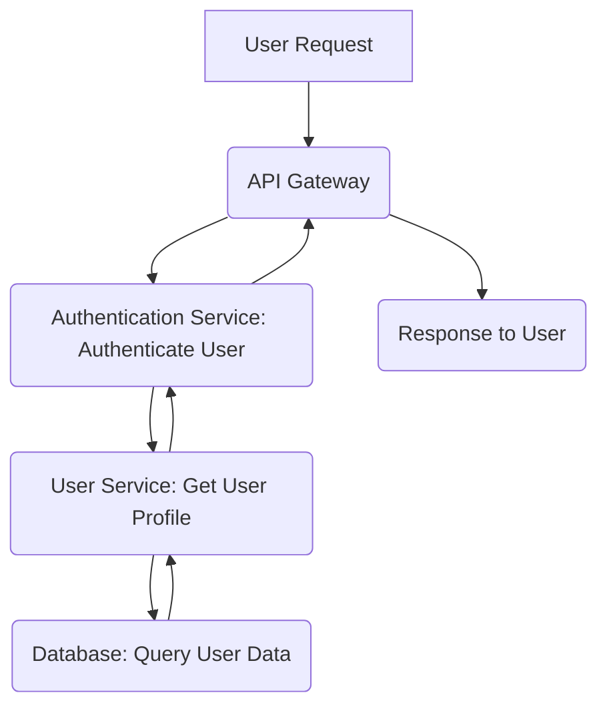

# API Monitoring, Logging & Tracing: Comprehensive Observability

## Introduction to API Observability
APIs are the backbone of modern applications. Ensuring their reliability, performance, and security requires a robust observability strategy. Observability goes beyond traditional monitoring by enabling deeper introspection into the internal state of a system, allowing engineers to ask arbitrary questions about its behavior. This guide covers the three pillars of observability for APIs: Monitoring, Logging, and Tracing.

## 1. API Monitoring: Understanding System Health and Performance

API Monitoring is the process of collecting and analyzing metrics to gain insights into the health, performance, and usage of your APIs. It answers questions like: "Is the API available?", "How fast is it?", "Are there errors?", and "What's the overall load?".

### Key Metrics for API Monitoring

#### RED Method (for Services/APIs)
The RED method is a simple yet powerful set of metrics for understanding the user-facing experience of your services:
*   **R**ate: The number of requests per second. (How much demand is there?)
*   **E**rrors: The number of failed requests per second (e.g., HTTP 5xx responses). (Is the API failing?)
*   **D**uration: The amount of time it takes to process requests (latency). This is often measured as percentiles (e.g., p50, p90, p99). (How fast is the API responding?)

#### USE Method (for Resources)
The USE method is focused on resource utilization and is excellent for understanding the health of underlying infrastructure components (CPU, Memory, Disk, Network):
*   **U**tilization: The average time a resource is busy. (Is the resource being used effectively?)
*   **S**aturation: The degree to which a resource has extra work it can't service, often manifesting as a queue. (Is the resource overloaded?)
*   **E**rrors: The number of errors observed by the resource. (Is the resource encountering problems?)

### Tools and Concepts
Common tools include Prometheus for metric collection and Grafana for visualization and dashboarding. These allow you to create real-time views of your API's performance and set up alerts.

### Example: Monitoring API Latency
Imagine an API endpoint `/users`. You would monitor:
*   `rate_http_requests_total{endpoint="/users"}`
*   `http_requests_errors_total{endpoint="/users", status_code=~"5..", method="GET"}`
*   `http_request_duration_seconds_bucket{endpoint="/users", le="0.1"}` (and other buckets for latency distribution)

## 2. Logging: Detailed Event Records for Debugging

Logging involves recording discrete events that occur within your application or system. These logs provide crucial context for debugging, auditing, and understanding the flow of execution.

### Structured Logging
Instead of plain text logs, structured logging outputs logs in a machine-readable format, typically JSON. This makes logs much easier to parse, search, and analyze with log management systems.

**Benefits of Structured Logging:**
*   **Easier Search & Filtering**: Query specific fields (e.g., `user_id: "123"`).
*   **Enhanced Analysis**: Aggregate data, create dashboards, and identify patterns.
*   **Contextual Information**: Include relevant details like request ID, user ID, trace ID, error code, service name, etc.

### Example: Structured Log Entry

```json
{
  "timestamp": "2023-10-27T10:30:00.123Z",
  "level": "ERROR",
  "service": "user-service",
  "method": "GET",
  "path": "/users/123",
  "status_code": 500,
  "request_id": "abc-123-def-456",
  "user_id": "usr-007",
  "error_message": "Database connection failed",
  "component": "user-repository"
}
```

### Tools and Concepts
Popular log management solutions include the ELK Stack (Elasticsearch, Logstash, Kibana), Splunk, Datadog Logs, and Grafana Loki. These systems ingest, store, search, and visualize log data.

## 3. Distributed Tracing: Following a Request's Journey

In microservices architectures, a single user request can traverse multiple services. Distributed tracing allows you to visualize the end-to-end journey of a request across these services, making it invaluable for understanding latency bottlenecks and pinpointing the root cause of issues.

### How Distributed Tracing Works
*   **Trace**: Represents the entire lifecycle of a request, from start to finish.
*   **Span**: A single operation or unit of work within a trace (e.g., an HTTP request to another service, a database query, or a function call). Spans have a start time, end time, and attributes (metadata).
*   **Parent-Child Relationship**: Spans are organized hierarchically, showing which operations initiate others.
*   **Context Propagation**: A unique `trace_id` and `span_id` are passed along with the request as it moves between services, linking all operations to the same trace.

### OpenTelemetry
OpenTelemetry (OTel) is a vendor-agnostic set of APIs, SDKs, and tools used to instrument, generate, collect, and export telemetry data (metrics, logs, and traces). It provides a standardized way to instrument your code, allowing you to switch observability backends without re-instrumenting.

### Example: Conceptual Trace Flow


Each arrow represents a span, and the entire flow is a single trace.

### Tools and Concepts
OpenTelemetry is the industry standard for instrumentation. Backends like Jaeger, Zipkin, Datadog APM, New Relic, and Grafana Tempo are used to store, visualize, and analyze trace data.

## 4. Alerting: Proactive Issue Detection

Alerting is the process of notifying engineers when predefined thresholds or conditions are met, indicating potential issues with the API or platform. Effective alerting is crucial for rapid response and minimizing downtime.

### Principles of Effective Alerting
*   **Actionable**: Alerts should provide enough context for an engineer to understand the problem and know where to start investigating.
*   **Relevant**: Avoid alert fatigue by only alerting on conditions that truly require human intervention.
*   **Thresholds**: Base alerts on critical metrics (e.g., error rate, latency percentiles, resource saturation).
*   **Notification Channels**: Integrate with communication platforms like Slack, PagerDuty, email, etc.

### Example: Alert Rule
**Condition**: "If the average HTTP 5xx error rate for the `/orders` API endpoint exceeds 5% over the last 5 minutes, fire a critical alert."
**Target**: Slack channel `#api-alerts` and PagerDuty for on-call team.

## Conclusion: Building a Comprehensive Observability Strategy

By integrating monitoring, structured logging, and distributed tracing, platform engineers can build a comprehensive observability strategy. This allows for proactive identification of issues, efficient root cause analysis, and continuous improvement of API reliability and performance.

---

## Quick Checklist / Exercise

1.  **Identify RED Metrics**: For a new API endpoint `/products/{id}`, list two specific metrics you would monitor using the RED method.
2.  **Structured vs. Plain Logs**: Explain why you would prefer structured logging (e.g., JSON) over plain text logs when debugging an issue across multiple microservices.
3.  **Tracing Benefits**: Describe how distributed tracing helps diagnose a high-latency issue that involves calls to three different backend services (`ServiceA` -> `ServiceB` -> `ServiceC`).