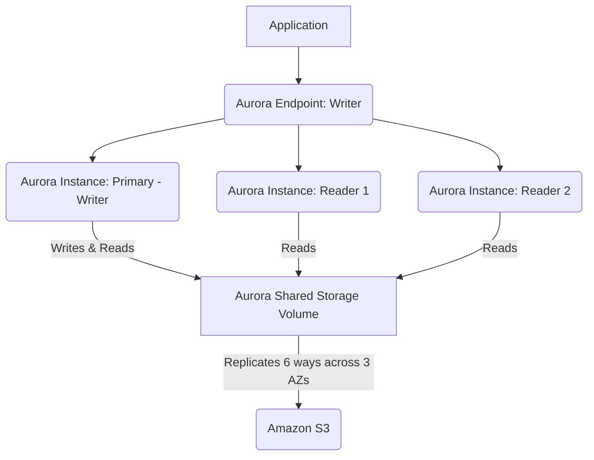

# Amazon Aurora: A Cloud-Native Relational Database

Amazon Aurora is a fully managed, MySQL and PostgreSQL-compatible relational database built for the cloud. It combines the speed and availability of high-end commercial databases with the simplicity and cost-effectiveness of open-source databases. Aurora is designed to deliver high performance, scalability, and availability, making it an ideal choice for demanding enterprise applications.

## Key Features and Benefits

*   **High Performance:** Aurora can deliver up to five times the throughput of standard MySQL and up to three times the throughput of standard PostgreSQL, without requiring changes to most existing applications. This is achieved through a distributed, fault-tolerant, and self-healing storage system.
*   **Scalability:** Storage automatically scales in increments of 10GB up to 128TB without any downtime. Compute resources can also be scaled independently, allowing you to easily adjust capacity based on demand.
*   **High Availability and Durability:** Aurora's architecture is designed for extreme availability. It replicates your data six ways across three Availability Zones (AZs) and transparently handles the loss of up to two copies of data without affecting database write availability and up to three copies without affecting read availability. It also features automatic crash recovery and point-in-time recovery.
*   **Cost-Effectiveness:** Pay-as-you-go pricing with no upfront costs or license fees. Aurora also offers Aurora Serverless, which automatically starts up, shuts down, and scales capacity based on your application's needs, billing only for the capacity consumed.
*   **Security:** Aurora provides multiple layers of security, including network isolation using Amazon VPC, encryption at rest using AWS Key Management Service (KMS), and encryption in transit using SSL/TLS.
*   **Backups and Restore:** Automated backups are enabled by default, and you can restore your database to any point in time within the retention period (up to 35 days).
*   **Global Database:** For globally distributed applications, Aurora Global Database allows a single Aurora database to span multiple AWS regions, enabling fast local reads and disaster recovery from region-wide outages.

## Aurora Architecture Overview

Aurora's architecture separates storage from compute. Unlike traditional databases where storage and compute are tightly coupled, Aurora's shared, distributed storage layer scales independently from its compute instances.

*   **Compute Layer:** Consists of one primary (writer) instance and up to 15 replica (reader) instances. The primary instance handles all writes and reads, while replicas offload read traffic, improving scalability and availability.
*   **Storage Layer:** A single, distributed, fault-tolerant, and self-healing storage volume that spans multiple Availability Zones. Data is continuously backed up to S3 and replicated across AZs for high durability. Write operations are processed by the storage layer with minimal latency, while read operations can be served from any of the instances.



## Example: Creating an Aurora Cluster (Conceptual AWS CLI)

While a full cluster setup involves many parameters, here's a simplified conceptual command to illustrate creating an Aurora MySQL cluster:

```bash
aws rds create-db-cluster \
    --db-cluster-identifier my-aurora-cluster \
    --engine aurora-mysql \
    --engine-version 8.0.mysql_aurora.3.02.0 \
    --master-username admin \
    --master-user-password MySecurePassword123! \
    --vpc-security-group-ids sg-xxxxxxxxxxxxxxxxx \
    --db-subnet-group-name my-db-subnet-group \
    --storage-encrypted \
    --tags Key=Environment,Value=Dev
```

After creating the cluster, you'd typically create a DB instance (e.g., `create-db-instance`) and connect to the cluster endpoint.

## Quick Understanding Check

1.  **Distinguish Aurora from standard RDS databases.** What is a primary architectural difference that contributes to its performance and availability?
2.  **Scenario:** Your application requires extremely high read throughput and needs to scale reads horizontally. How would Amazon Aurora help you achieve this?
3.  **True or False:** Amazon Aurora is only compatible with MySQL databases.