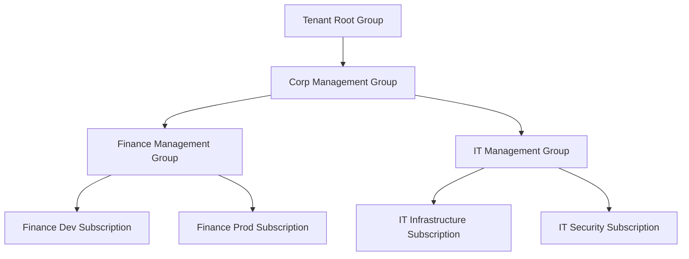

# Azure Management Groups & Subscriptions: Scalable Governance

## Introduction
In the Azure cloud environment, effectively organizing and managing resources is crucial for operational efficiency, security, and cost control. Azure Management Groups and Subscriptions provide the foundational structure to achieve scalable governance, streamlined access management, and robust cost reporting across your entire Azure estate. Understanding their hierarchy and interplay is fundamental for any Azure Cloud Engineer.

## 1. Azure Subscriptions

An Azure Subscription serves as a logical container for your Azure services and resources. It acts as a unit for several critical aspects:

*   **Billing Boundary**: All resources deployed within a subscription are billed together. You can have different billing models (e.g., Pay-As-You-Go, Enterprise Agreement, Cloud Solution Provider) for different subscriptions.
*   **Access Control Boundary**: Azure Role-Based Access Control (RBAC) is applied at the subscription level. Users, groups, and service principals can be granted specific roles (e.g., Contributor, Reader, Owner) to manage resources within that subscription.
*   **Resource Deployment Target**: When you create resources like Virtual Machines, Storage Accounts, or Web Apps, they are always deployed into a specific subscription.

Organizations often use multiple subscriptions to segment workloads, environments (dev, test, prod), departments, or even legal entities. While subscriptions provide a good first level of organization, managing governance across many subscriptions can become complex, which is where Management Groups come in.

## 2. Azure Management Groups

Azure Management Groups are containers that sit above subscriptions, providing a level of scope above subscriptions. They allow you to organize your subscriptions into a hierarchical structure, enabling you to apply governance policies, access conditions, and compliance requirements to all subscriptions within that group and its child groups.

### Key Characteristics:

*   **Hierarchy**: Management groups form a tree-like structure. The topmost group is the "Root Management Group" (automatically created), under which you can create child management groups and place subscriptions.
*   **Policy and RBAC Inheritance**: Policies and RBAC assignments applied at a management group level inherit down to all child management groups and subscriptions. This ensures consistent governance across your organization without needing to apply policies individually to each subscription.
*   **Scalable Governance**: Instead of applying policies to hundreds of subscriptions individually, you can apply them once at a higher-level management group, and they will cascade down.
*   **Cost Management Integration**: Management groups can also be used as a scope for Azure Cost Management + Billing, allowing for consolidated cost reporting across multiple subscriptions.

### Hierarchy Example:



## 3. How They Work Together

The hierarchy works by allowing you to define policies and roles at a higher scope (Management Group) that automatically apply to all child scopes (other Management Groups and Subscriptions). This is critical for achieving enterprise-scale governance:

*   **Centralized Policy Enforcement**: Enforce common security policies, compliance standards, or resource naming conventions across all relevant subscriptions from a single point.
*   **Simplified Access Management**: Grant specific users or groups permissions at a management group level, and those permissions will propagate to all contained subscriptions, simplifying onboarding and offboarding processes.
*   **Consistent Resource Configuration**: Ensure that all resources within a certain department or environment adhere to specific configurations (e.g., requiring all storage accounts to have encryption enabled).

## Configuration Example (Azure CLI)

Here's how you might use the Azure CLI to create a management group and move a subscription into it.

1.  **Create a Management Group:**

    ```bash
az mg create --name "DevAndTestMG" --display-name "Development and Test" --parent "Tenant Root Group"
    ```

    This command creates a new management group named `DevAndTestMG` with the display name "Development and Test" under the `Tenant Root Group`.

2.  **Get the Subscription ID:**

    First, find the ID of the subscription you want to move.

    ```bash
az account list --query "[?name=='Your Subscription Name'].id" -o tsv
    ```

    Replace "Your Subscription Name" with the actual name of your Azure subscription.

3.  **Move a Subscription to a Management Group:**

    ```bash
az account management-group assign --name "DevAndTestMG" --subscription "<your_subscription_id>"
    ```

    Replace `<your_subscription_id>` with the actual ID obtained in the previous step.

Now, any policies or RBAC assignments applied to `DevAndTestMG` will also apply to the moved subscription.

## Quick Understanding Checklist/Exercise

1.  **Scenario**: Your organization wants to enforce a policy that all storage accounts must use HTTPS for transfer, and this policy should apply to all `Development` and `Staging` subscriptions. Where would you apply this policy within the Azure Management Group hierarchy for maximum efficiency?
2.  **Definition**: Explain the primary difference between an Azure Subscription and an Azure Management Group in terms of their purpose and scope.
3.  **Inheritance**: If a user is granted the "Reader" role at a Management Group level, what access will they have on a subscription nested two levels deep within that Management Group?