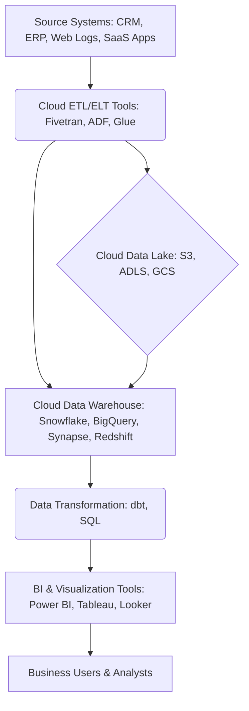

# Modern Cloud BI Stack: Data Platforms & Services

## Introduction to the Modern Cloud BI Stack
The modern Business Intelligence (BI) stack has profoundly transformed with the advent of cloud computing. Cloud-native BI architectures offer unparalleled scalability, flexibility, and cost-efficiency, moving beyond the limitations of traditional on-premise solutions. At its core, a modern cloud BI stack is meticulously engineered to ingest vast amounts of diverse data, process it with high efficiency, and deliver actionable insights rapidly to empower data-driven decision-making.

## Key Components of a Modern Cloud BI Architecture

A typical modern cloud BI architecture is an integrated ecosystem comprising several critical services and platforms:

1.  **Data Ingestion & Integration (ETL/ELT Tools):**
    *   **Purpose:** To extract raw data from various source systems (e.g., operational databases, APIs, SaaS applications, flat files), load it into a central repository, and subsequently transform it into a format suitable for analytical consumption.
    *   **Shift to ELT:** In the cloud era, ELT (Extract, Load, Transform) has largely superseded traditional ETL. This paradigm shift involves loading raw data directly into a powerful cloud data warehouse or data lake, with transformations occurring within the cloud data platform itself, leveraging its inherent scalability and processing power.
    *   **Examples of Cloud ETL/ELT Tools:**
        *   **Managed Services:** AWS Glue, Azure Data Factory, Google Cloud Dataflow.
        *   **SaaS Connectors:** Fivetran, Stitch, Airbyte. These platforms provide pre-built connectors to numerous data sources, significantly simplifying the data ingestion process.

2.  **Cloud Data Platforms (Data Warehouses & Data Lakes):**
    *   **Purpose:** These serve as centralized repositories for storing and managing large volumes of structured, semi-structured, and unstructured data, critically optimized for high-performance analytical queries.

    ### Cloud Data Warehouses
    These are highly optimized relational databases meticulously engineered for analytical workloads (OLAP). They feature columnar storage, Massively Parallel Processing (MPP) architectures, and a crucial separation of compute from storage, enabling independent scaling of resources.

    *   **Snowflake:**
        *   **Key Features:** Cloud-agnostic (deployable across AWS, Azure, GCP), distinct "virtual warehouses" for isolated compute resources, automatic scaling, native support for semi-structured data (JSON, XML, Avro). Renowned for its ease of use, performance, and concurrency.
        *   **Role:** Primarily functions as a powerful data warehouse, but its architecture also supports data lakehouse capabilities.

    *   **Google BigQuery:**
        *   **Key Features:** Fully serverless architecture, petabyte-scale scalability, real-time analytics capabilities, integrated machine learning features (BigQuery ML), and deep integration within the Google Cloud ecosystem.
        *   **Role:** A fully managed, serverless enterprise data warehouse, ideal for extremely large datasets and real-time analytical needs.

    *   **Azure Synapse Analytics:**
        *   **Key Features:** A unified analytics service that consolidates enterprise data warehousing (SQL pools), big data processing (Spark pools), data integration (pipelines), and comprehensive monitoring. Offers deep integration with other Azure services.
        *   **Role:** An integrated analytics platform that seamlessly combines traditional data warehousing with big data processing functionalities.

    *   **AWS Redshift:**
        *   **Key Features:** Fully managed, petabyte-scale data warehouse service, columnar storage, MPP architecture, and tight integration with other AWS services (e.g., S3, Glue, Kinesis). Redshift Spectrum allows direct querying of data stored in S3.
        *   **Role:** A robust, managed data warehousing solution specifically within the AWS cloud ecosystem.

    ### Data Lakes
    *   **Purpose:** A vast storage repository designed to hold enormous amounts of raw data in its native format until it is required. Data lakes are typically constructed upon object storage services such as AWS S3, Azure Data Lake Storage (ADLS), or Google Cloud Storage (GCS).
    *   **Role in BI:** Often serve as the initial landing zone for all data before it undergoes curation and movement to a data warehouse, or they can be directly queried by analytics tools for specific use cases, forming the basis of a "Data Lakehouse" architecture.

3.  **Data Transformation (In-warehouse or Dedicated Tools):**
    *   **Purpose:** The crucial process of cleaning, structuring, aggregating, and enriching raw data to transform it into a format that is optimally suited for BI reporting and sophisticated analysis.
    *   **Tools:** Often executed directly within the cloud data warehouse using SQL. Specialized tools like **dbt (Data Build Tool)** significantly facilitate version-controlled, modular, and testable data transformations directly within the data warehouse environment.

4.  **BI & Visualization Tools:**
    *   **Purpose:** These applications connect to the curated data in the data warehouse/lake to create interactive dashboards, comprehensive reports, and compelling data visualizations, empowering end-users to intuitively explore data and extract actionable insights.
    *   **Examples:** Microsoft Power BI, Tableau, Looker, Qlik Sense.

## The Role in Scalable BI Solutions

The symbiotic integration of these components culminates in a highly scalable, performant, and robust BI solution:

*   **Scalability:** Cloud data warehouses and ELT tools offer elastic scaling of compute and storage resources, automatically adapting to fluctuating data volumes and query loads without requiring manual intervention.
*   **Performance:** The combination of decoupled storage and compute, columnar storage, and MPP architectures ensures extremely fast query execution even on petabyte-scale datasets.
*   **Flexibility:** Native support for diverse data types (structured, semi-structured, unstructured) and seamless integration with a multitude of data sources provides unparalleled flexibility.
*   **Cost-Efficiency:** Pay-as-you-go pricing models eliminate the need for substantial upfront infrastructure investments, allowing organizations to pay only for the resources they actually consume.
*   **Agility:** Faster data ingestion and transformation cycles lead to expedited insight generation, directly translating into more agile and better-informed business decision-making.

## Conceptual Architecture Flow (Simplified)

## Quick Checklist/Exercise

1.  **Identify the Key Shift:** What is the primary architectural reason why ELT has become more prevalent than traditional ETL in modern cloud BI architectures?
2.  **Compare Cloud Data Warehouses:** Briefly describe one unique feature or primary advantage of either Google BigQuery or Azure Synapse Analytics.
3.  **Scalability Aspect:** How does the "decoupled compute and storage" architecture in cloud data warehouses significantly contribute to their ability to scale efficiently and cost-effectively?