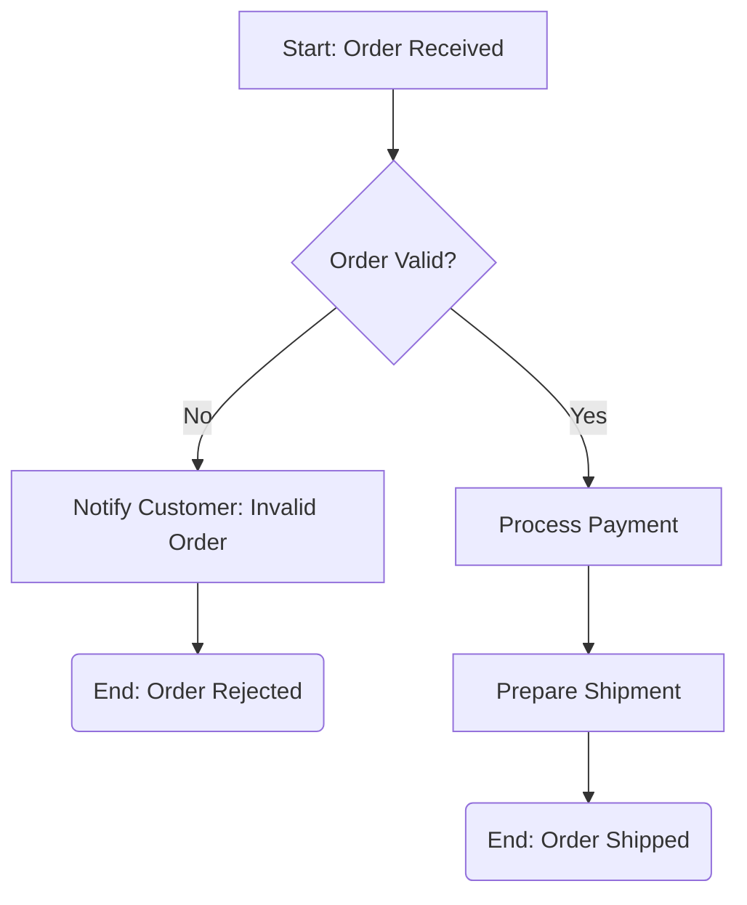

# Study Guide: Business Process Modeling & Optimization

This study guide provides a comprehensive overview of Business Process Modeling & Optimization, a critical skill for any Business Analyst. You will learn to map, analyze, and improve business processes using industry-standard techniques and methodologies.

## 1. Introduction to Business Process Modeling & Optimization

Business Process Modeling involves graphically representing an organization's business processes to understand, analyze, and communicate them effectively. Business Process Optimization focuses on improving these processes to enhance efficiency, reduce costs, improve quality, and achieve organizational goals. It's about moving from an 'As-Is' state to an optimized 'To-Be' state.

## 2. Core Process Mapping & Modeling Techniques

### 2.1 Flowcharts
A fundamental diagram illustrating the sequence of operations, decisions, and data flow within a process.
- **Symbols:** Ovals (Start/End), Rectangles (Process Step), Diamonds (Decision), Arrows (Flow).
- **Use Case:** Simple processes, illustrating basic logic.

### 2.2 Swimlane Diagrams (Cross-Functional Flowcharts)
Extend standard flowcharts by categorizing process steps into "lanes" representing departments, roles, or systems responsible for those steps. This clarifies accountability and handoffs.
- **Use Case:** Processes involving multiple teams or departments, highlighting collaboration and potential bottlenecks at handoff points.

### 2.3 SIPOC Diagram (Suppliers, Inputs, Process, Outputs, Customers)
A high-level process mapping tool used to identify the key elements of a process before more detailed mapping begins. It defines the boundaries and scope of a process.
- **Components:**
    - **S**uppliers: Who provides inputs to the process?
    - **I**nputs: What materials, information, or resources are needed?
    - **P**rocess: The high-level steps of the process.
    - **O**utputs: What products or services result from the process?
    - **C**ustomers: Who receives the outputs of the process?
- **Use Case:** Scoping projects, understanding stakeholder perspectives, and initiating process improvement efforts.

### 2.4 Value Stream Mapping (VSM)
A Lean management technique for analyzing the flow of materials and information required to bring a product or service to a customer. It visually distinguishes between value-adding and non-value-adding activities.
- **Key Metrics:** Cycle time, lead time, processing time, wait time, inventory levels.
- **Goal:** Identify and eliminate waste (Muda) to create a more efficient "value stream."
- **Use Case:** Manufacturing, service delivery, software development, identifying opportunities for Lean improvements.

### 2.5 Decision Trees
A tree-like model of decisions and their possible consequences, including chance event outcomes, resource costs, and utility. Used to analyze and make structured decisions.
- **Components:** Decision nodes (squares), Chance nodes (circles), End nodes (triangles), Branches.
- **Use Case:** Analyzing complex decisions with multiple possible outcomes and risks, e.g., "should we launch a new product?" or "what approval path should this request follow?".

## 3. Business Process Model and Notation (BPMN 2.0)

BPMN 2.0 is a standardized graphical notation for specifying business processes. It's designed to be understandable by business users while also being precise enough to represent complex process semantics and even be executable by process engines.

- **Key Elements:**
    - **Flow Objects:**
        - **Events:** Something that happens (Start, Intermediate, End). Represented by circles.
        - **Activities:** Work that is performed (Tasks, Sub-processes). Represented by rounded rectangles.
        - **Gateways:** Controls the divergence and convergence of sequence flow (Exclusive, Parallel, Inclusive, Complex, Event-based). Represented by diamonds.
    - **Connecting Objects:**
        - **Sequence Flows:** Order of activities (solid arrow).
        - **Message Flows:** Messages exchanged between participants (dashed arrow with open circle and arrow).
        - **Associations:** Connect text or artifacts to flow objects (dotted line).
    - **Swimlanes:**
        - **Pools:** Represents a participant (e.g., an organization or department). Contains one or more Lanes.
        - **Lanes:** Sub-partitions within a Pool, representing roles or departments.
    - **Artifacts:**
        - **Data Objects:** Data required or produced by activities.
        - **Text Annotations:** Explanations.
        - **Groups:** Logical grouping of elements.

### Simple BPMN Example: Order Processing

*This is a simplified textual representation for illustration; actual BPMN uses specific visual symbols and more complex constructs.*

## 4. Process Analysis & Optimization Methodologies

### 4.1 'As-Is' vs. 'To-Be' Analysis
- **'As-Is' (Current State):** Documenting how a process currently operates. This involves observation, interviews, and data collection to understand existing steps, resources, pain points, and performance.
- **'To-Be' (Future State):** Designing the improved or desired state of the process, incorporating solutions to identified issues and aiming for better efficiency, quality, and cost-effectiveness.

### 4.2 Bottleneck Identification
A bottleneck is a point in a process where the flow of work is impeded or stopped, causing delays and reducing overall throughput. Identifying bottlenecks is crucial for optimization.
- **Techniques:** Process mapping, data analysis (e.g., queue times, resource utilization), direct observation.

### 4.3 Gap Analysis
Comparing the 'As-Is' process with the 'To-Be' process to identify the differences (gaps) and determine what changes are needed (technology, training, policy, organizational structure) to transition to the future state.

### 4.4 Data-Driven Process Improvements (Lean & Six Sigma)

#### Lean Principles
Focuses on maximizing customer value while minimizing waste.
- **The 8 Wastes (DOWNTIME):**
    - **D**efects: Errors that require rework.
    - **O**verproduction: Producing more than needed.
    - **W**aiting: Time spent idle.
    - **N**on-utilized Talent: Underutilizing skills and knowledge.
    - **T**ransportation: Unnecessary movement of goods.
    - **I**nventory: Excess materials or work-in-progress.
    - **M**otion: Unnecessary movement by people.
    - **E**xcess Processing: More work than required by the customer.
- **Goal:** Streamline processes, reduce lead times, improve flow.

#### Six Sigma Principles
Focuses on reducing process variation and improving quality by identifying and removing the causes of defects and errors.
- **DMAIC Methodology:**
    - **D**efine: Define the problem, customer requirements, and project goals.
    - **M**easure: Collect data to quantify the problem.
    - **A**nalyze: Identify the root causes of defects and inefficiencies.
    - **I**mprove: Implement solutions to eliminate root causes.
    - **C**ontrol: Implement controls to sustain the improvements.
- **Goal:** Achieve near-perfect quality (3.4 defects per million opportunities).

## 5. Quick Checklist/Exercise

1.  **Identify the right tool:** For a process involving handoffs between five different departments, which process mapping technique would best highlight responsibilities and transfer points?
2.  **BPMN Elements:** If a process needs to diverge based on a decision ("Is the application complete?"), what BPMN element would you use?
3.  **Lean Waste:** A customer service team spends 30% of its time re-entering data due to errors in the initial form submission. Which Lean waste does this primarily represent, and how could Six Sigma help address it?
