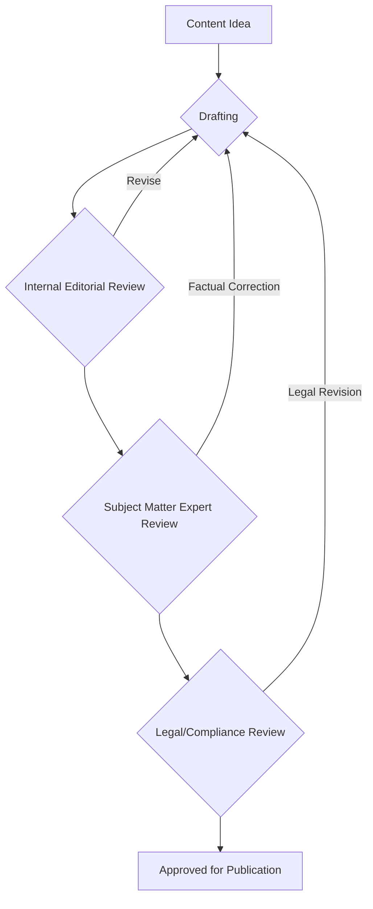

# Holistic Content Strategy & Governance

A holistic content strategy goes beyond mere content creation; it encompasses the entire lifecycle of content within an organization, ensuring it consistently aligns with business objectives, maintains quality, adheres to compliance standards, and scales effectively. It's about creating a unified vision for all content, from marketing materials to product documentation, and establishing the frameworks to manage it sustainably and efficiently across the enterprise.

## Core Components of Holistic Content Strategy

### 1. Content Strategy Alignment with Business Goals
The bedrock of any effective content strategy is its direct link to overarching business objectives. Content should actively contribute to tangible goals such as increasing brand awareness, driving sales, improving customer satisfaction, enhancing operational efficiency, or facilitating product adoption.

*   **Key Action:** Define measurable content KPIs (Key Performance Indicators) that directly map to existing business KPIs. For instance, if a business aims to "reduce customer support inquiries by 10%," the content strategy might focus on creating comprehensive self-service documentation or FAQs, tracked by deflection rates.

### 2. Content Lifecycle Management
Content, like any product, has a lifecycle. Actively managing this lifecycle ensures content remains relevant, accurate, and valuable throughout its existence.

*   **Phases:**
    *   **Planning:** Ideation, audience research, keyword strategy, goal setting, content mapping.
    *   **Creation:** Writing, editing, designing, development, localization (if applicable).
    *   **Publication:** Choosing distribution channels, scheduling, technical implementation (e.g., CMS publishing).
    *   **Promotion:** Amplification through SEO, social media, paid ads, email marketing.
    *   **Maintenance & Optimization:** Performance monitoring, A/B testing, regular updates, repurposing content for new formats or audiences.
    *   **Archiving & Retirement:** Removing outdated, inaccurate, or irrelevant content to maintain content hygiene and search engine optimization.

### 3. Content Governance Models
Content governance defines the rules, roles, and responsibilities for managing content across an organization. It ensures consistency, quality, legal compliance, and strategic alignment.

*   **Key Elements:**
    *   **Roles & Responsibilities:** Clearly define who is responsible for content strategy, creation, approval, editing, publishing, and archiving. Examples include Content Strategist, Editor-in-Chief, Subject Matter Expert (SME), Legal Reviewer, and Webmaster.
    *   **Workflows & Processes:** Document the standardized steps content takes from ideation to retirement, including all required review and approval stages.
    *   **Style Guides & Brand Guidelines:** Establish comprehensive standards for tone, voice, terminology, visual identity, formatting, and accessibility. These ensure content consistency regardless of the creator.
    *   **Technology & Tools:** Identify and integrate appropriate content management systems (CMS), digital asset management (DAM) systems, project management tools, analytics platforms, and SEO tools.

**Example of a simplified content approval workflow:**

### 4. Content Quality Assurance
Ensuring high-quality content is paramount for credibility and effectiveness. This involves meticulous editorial processes, fact-checking, and adherence to established technical and strategic specifications.

*   **Key Checkpoints:**
    *   Accuracy and reliability of information, including proper citation.
    *   Clarity, conciseness, and engagement for the target audience.
    *   Grammar, spelling, and punctuation free from errors.
    *   Adherence to internal style guides and brand voice.
    *   SEO optimization (if applicable), including keyword usage and metadata.
    *   Compliance with accessibility standards (e.g., WCAG) for inclusive design.

### 5. Content Compliance and Legal Considerations
Content must adhere to relevant laws, regulations, and company policies, especially concerning data privacy (e.g., GDPR, CCPA), intellectual property (copyright, trademarks), accessibility, and necessary disclaimers.

*   **Key Actions:**
    *   Establish regular legal reviews for specific content types (e.g., financial advice, health information, user-generated content).
    *   Provide mandatory training for all content creators on compliance requirements.
    *   Implement clear content disclaimers, privacy policies, and terms of service where legally required.

### 6. Content Scalability and Reusability
A holistic strategy plans for content that can grow and adapt with the organization, maximizing efficiency through repurposing and modular design.

*   **Strategies:**
    *   **Modular Content:** Break down content into smaller, standalone, reusable components (e.g., product feature descriptions, FAQs, definitions, image assets). This facilitates 