# Capstone Project: End-to-End Data Platform

## Overview
A Capstone Project in Data Engineering is your opportunity to synthesize all acquired knowledge into a practical, real-world solution. This project focuses on designing, building, and deploying a complete data platform, simulating a production environment. You will integrate various components, from raw data ingestion to a serving layer for analytics or machine learning, leveraging cloud services and adhering to industry best practices for scalability, reliability, and maintainability.

## Key Components of an End-to-End Data Platform
An end-to-end data platform typically comprises several interconnected stages:

### 1. Data Ingestion
This stage involves collecting raw data from various sources.
*   **Batch Ingestion**: For periodic data loads (e.g., daily logs, database dumps).
    *   **Tools/Services**: AWS S3, Google Cloud Storage, Azure Data Lake Storage, Apache Sqoop, Kafka Connect.
*   **Streaming Ingestion**: For real-time data processing (e.g., sensor data, clickstreams).
    *   **Tools/Services**: Apache Kafka, AWS Kinesis, Google Cloud Pub/Sub, Azure Event Hubs.

### 2. Data Storage & Warehousing (Data Lakehouse)
A modern approach combining the flexibility of a data lake with the structure of a data warehouse.
*   **Concept**: Store raw, semi-structured, and structured data in open formats (Parquet, ORC) on object storage. Apply schema and ACID transactions for structured layers.
*   **Tools/Services**:
    *   **Storage**: AWS S3, Google Cloud Storage, Azure Data Lake Storage Gen2.
    *   **Lakehouse Formats**: Delta Lake, Apache Iceberg, Apache Hudi.
    *   **Query Engines**: Apache Spark, AWS Athena, Google BigQuery, Azure Synapse Analytics, Presto/Trino.

### 3. Data Transformation
Processing and refining raw data into a clean, structured, and query-optimized format. This often involves cleaning, filtering, enriching, and aggregating data.
*   **Paradigms**:
    *   **ETL (Extract, Transform, Load)**: Transform data before loading into the target system.
    *   **ELT (Extract, Load, Transform)**: Load raw data first, then transform it within the target system (common in data lakehouses).
*   **Tools/Services**:
    *   **Batch**: Apache Spark (Databricks, EMR, DataProc), AWS Glue, dbt (data build tool).
    *   **Streaming**: Apache Flink, Spark Streaming, Kafka Streams.

### 4. Data Quality & Governance
Ensuring data accuracy, consistency, completeness, and compliance throughout the pipeline.
*   **Concepts**: Data profiling, validation rules, schema evolution, metadata management.
*   **Tools/Services**: Great Expectations, Soda Core, Apache Atlas, custom validation scripts.

### 5. Workflow Orchestration
Managing and scheduling complex data pipelines, ensuring tasks run in the correct order, handling dependencies, and retries.
*   **Tools/Services**: Apache Airflow, Prefect, Dagster, AWS Step Functions, Google Cloud Composer, Azure Data Factory.

### 6. Serving Layer
Making processed data available to end-users, applications, or downstream systems.
*   **Analytics Dashboards**: Visualizing data for business insights.
    *   **Tools/Services**: Tableau, Power BI, Looker Studio (formerly Google Data Studio), Metabase, Superset.
*   **APIs for ML/Applications**: Providing data access programmatically.
    *   **Tools/Services**: FastAPI, Flask, AWS Lambda + API Gateway, Google Cloud Functions, Azure Functions.
*   **Data Marts**: Specialized data stores for specific business units or applications.

## Cloud Services Integration
Leveraging cloud platforms is crucial for building scalable and cost-effective data platforms.
*   **AWS**: S3, Kinesis, Glue, EMR, Athena, Redshift, Lambda, API Gateway, SageMaker, Airflow (MWAA), Step Functions.
*   **Google Cloud (GCP)**: Cloud Storage, Pub/Sub, Dataflow, Dataproc, BigQuery, Cloud Functions, AI Platform, Cloud Composer, Cloud Run.
*   **Azure**: Data Lake Storage Gen2, Event Hubs, Azure Databricks, Synapse Analytics, Azure Functions, Azure Data Factory, Azure ML.

## Best Practices for Your Capstone Project
*   **Scalability**: Design components to handle increasing data volumes and velocity.
*   **Reliability & Fault Tolerance**: Implement mechanisms for error handling, retries, and data recovery.
*   **Cost Optimization**: Choose appropriate cloud services and optimize resource usage.
*   **Security**: Implement robust access controls, encryption, and network isolation.
*   **Monitoring & Alerting**: Set up comprehensive monitoring for pipeline health and data quality.
*   **Infrastructure as Code (IaC)**: Use tools like Terraform or CloudFormation to provision and manage cloud resources.
*   **Modularity**: Break down the project into smaller, manageable components.
*   **Documentation**: Thoroughly document your design, implementation, and deployment steps.

## Example: Conceptual Data Pipeline Flow (ELT using Cloud Services)

```mermaid
graph LR
    A[Raw Data Sources: RDBMS, APIs, Logs] --> B(Cloud Ingestion Service: Kafka/Kinesis/PubSub or DMS/Fivetran/Airbyte)
    B --> C(Raw Layer: Cloud Object Storage - S3/ADLS/GCS - Raw Parquet)
    C --> D(Data Transformation Engine: Spark/dbt on EMR/Databricks/Dataflow)
    D --> E(Staging/Curated Layer: Cloud Object Storage - S3/ADLS/GCS - Curated Delta/Iceberg Tables)
    E -- Data Quality Checks (Great Expectations) --> F(Orchestration Tool: Airflow/Prefect/ADF/Cloud Composer)
    F --> G(Serving Layer: Data Marts / Dashboards / APIs)
    G --> H[End Users: Analysts, ML Engineers, Applications]
```

*   **Ingestion**: Stream or batch data from various sources into a raw landing zone.
*   **Storage**: Store raw data in a data lake (object storage).
*   **Transformation**: Use a processing engine (e.g., Spark) to clean, enrich, and transform data, storing it back into structured layers within the data lakehouse.
*   **Orchestration**: Manage the flow and dependencies of all these steps using a scheduler.
*   **Serving**: Expose processed data through dashboards or APIs.

## Quick Checklist/Exercise
1.  **Identify suitable technologies**: For a capstone project involving real-time IoT sensor data ingestion, batch processing of historical data, and a serving layer for an anomaly detection ML model, list at least one specific cloud service/tool for each of the following components:
    *   Real-time ingestion:
    *   Batch ingestion:
    *   Data Lakehouse storage:
    *   Batch transformation:
    *   Workflow orchestration:
    *   Serving layer (ML API):
2.  **Scenario**: You've built a data pipeline, and now users report that the dashboard data is sometimes stale. What are two common causes for this issue, and how would you investigate them?
3.  **Data Quality**: Explain why data quality checks are critical *before* data reaches the serving layer, using an an example of potential business impact.