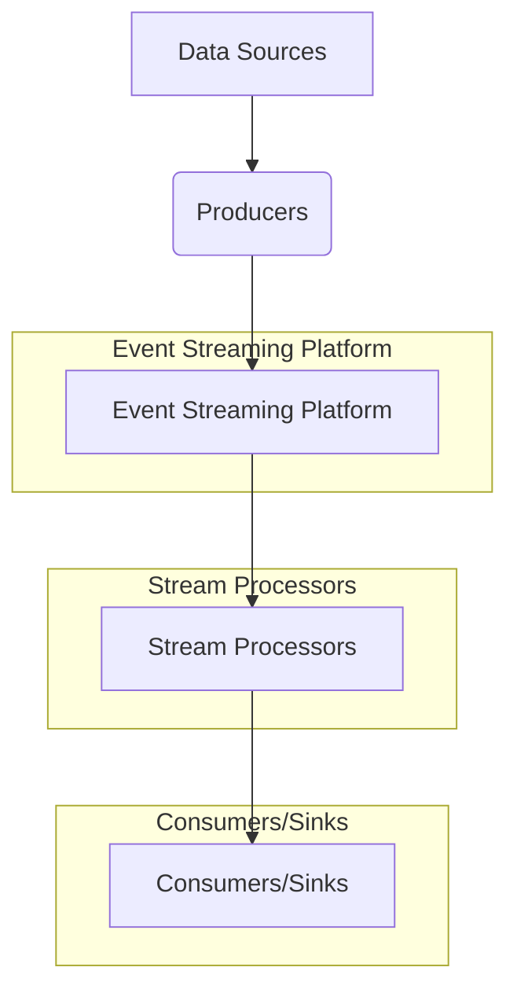

# Streaming Data Pipelines: A Study Guide

## Introduction
Streaming data pipelines are engineered systems that process data continuously as it is generated, rather than in discrete batches. This approach is crucial for applications requiring real-time or near real-time insights, enabling immediate reactions to events. They are foundational for use cases like real-time analytics, fraud detection, IoT monitoring, and personalized user experiences.

### Key Requirements:
*   **High Throughput**: Ability to process a massive volume of data events per second.
*   **Low Latency**: Minimal delay between an event occurring and its processing.
*   **Fault Tolerance**: Resilience against failures, ensuring data is not lost and processing continues.
*   **Scalability**: Capability to handle increasing data volumes and processing demands by adding resources.

## Core Concepts

### 1. Event Streaming Platforms
These platforms serve as the backbone, responsible for ingesting, storing, and distributing an immutable, ordered sequence of events. They decouple data producers from consumers.

*   **Apache Kafka**: A distributed streaming platform that enables publishing, subscribing to, storing, and processing event streams in real-time. It's built around topics (categories/feeds), partitions (ordered, immutable sequences of records), brokers (Kafka servers), producers (write data to topics), and consumers (read data from topics). It offers high throughput and durability.
*   **Apache Pulsar**: A cloud-native, distributed messaging and streaming platform from Apache Software Foundation.
*   **AWS Kinesis**: A fully managed streaming data service provided by Amazon Web Services.

### 2. Stream Processing Frameworks
These frameworks consume events from streaming platforms, apply transformations, aggregations, joins, and execute business logic, often maintaining state across events.

*   **Apache Flink**: A powerful open-source stream processing framework that excels at stateful computations over unbounded data streams. It supports event-time processing, sophisticated windowing, and exactly-once semantics.
*   **Apache Spark Structured Streaming**: An extension to Apache Spark that leverages the Spark SQL engine to process continuous streams of data. It treats a live data stream as a continuously appending table, offering a unified API for batch and stream processing. It operates in micro-batches or continuous processing mode.
*   **Kafka Streams**: A client-side library for building stream processing applications directly on Apache Kafka. It allows developers to write scalable, fault-tolerant applications for processing data stored in Kafka topics.

### 3. Key Characteristics and Challenges
*   **Throughput**: The volume of data events that can be processed per unit of time (e.g., messages/second).
*   **Latency**: The time delay from when an event is produced until it is processed and acted upon.
*   **Fault Tolerance**: The system's ability to continue operating correctly even if components fail.
*   **Exactly-Once Processing**: A guarantee that each event is processed neither more nor less than once, even in distributed environments with failures. This is a critical but complex guarantee to achieve.
*   **State Management**: Handling and maintaining application-specific state (e.g., counts, sums, last-seen values) across events, which is crucial for aggregations and pattern detection.
*   **Event Time vs. Processing Time**: Distinguishing between when an event actually occurred (`event time`) and when it was processed by the system (`processing time`). Handling out-of-order events using mechanisms like `watermarks` is vital for accurate event-time processing.
*   **Schema Evolution**: Managing changes to the structure of data (schemas) over time without breaking existing pipelines.

## Architecture of a Streaming Data Pipeline
A typical streaming data pipeline follows a layered architecture:

1.  **Data Sources**: Raw data origin points (e.g., IoT devices, website clickstreams, application logs, database change data capture (CDC)).
2.  **Producers**: Applications or services that collect data from sources and write it to the event streaming platform.
3.  **Event Streaming Platform**: Ingests, durable stores, and distributes the incoming event streams (e.g., Apache Kafka, AWS Kinesis).
4.  **Stream Processors**: Applications built with frameworks like Apache Flink, Spark Structured Streaming, or Kafka Streams that consume data from the streaming platform, apply transformations, enrichments, aggregations, and business logic.
5.  **Consumers/Sinks**: Applications or data stores that receive the processed data. This could be a real-time dashboard, a database (e.g., Cassandra, PostgreSQL), a data warehouse (e.g., Snowflake, BigQuery), another streaming platform, or a microservice.



## Conceptual Example: Real-time Anomaly Detection with Kafka Streams

Let's consider a simple Kafka Streams application to detect sensor readings that exceed a predefined threshold, signaling a potential anomaly.

```java
import org.apache.kafka.common.serialization.Serdes;
import org.apache.kafka.streams.KafkaStreams;
import org.apache.kafka.streams.StreamsBuilder;
import org.apache.kafka.streams.StreamsConfig;
import org.apache.kafka.streams.kstream.KStream;

import java.util.Properties;

public class SensorAnomalyDetector {

    public static void main(String[] args) {
        Properties props = new Properties();
        props.put(StreamsConfig.APPLICATION_ID_CONFIG, "sensor-anomaly-detector-app");
        props.put(StreamsConfig.BOOTSTRAP_SERVERS_CONFIG, "localhost:9092"); // Your Kafka broker(s)
        props.put(StreamsConfig.DEFAULT_KEY_SERDE_CLASS_CONFIG, Serdes.String().getClass());
        props.put(StreamsConfig.DEFAULT_VALUE_SERDE_CLASS_CONFIG, Serdes.Double().getClass());

        // Build the Kafka Streams topology
        StreamsBuilder builder = new StreamsBuilder();
        
        // Stream from the input topic where sensor readings are published
        KStream<String, Double> sensorReadings = builder.stream("sensor-input-topic");

        // Filter for readings above an anomaly threshold (e.g., 100.0)
        KStream<String, Double> highReadings = sensorReadings
            .filter((sensorId, value) -> value > 100.0);

        // Send the anomalous readings to an output topic
        highReadings.to("anomaly-output-topic");

        // Create and start the Kafka Streams application
        KafkaStreams streams = new KafkaStreams(builder.build(), props);
        
        // Clean up resources on shutdown
        Runtime.getRuntime().addShutdownHook(new Thread(streams::close));
        
        System.out.println("Starting Sensor Anomaly Detector Stream...");
        streams.start();
    }
}
```

**Explanation:**
1.  **Configuration**: Sets up the application ID, Kafka broker address, and default serializers/deserializers for keys (String) and values (Double).
2.  **`StreamsBuilder`**: Used to define the stream processing topology.
3.  **`builder.stream("sensor-input-topic")`**: Creates a `KStream` from a Kafka topic named `sensor-input-topic`, where sensor IDs are keys and their readings are double values.
4.  **`.filter((sensorId, value) -> value > 100.0)`**: This is the core processing logic. It filters the incoming stream, keeping only those records where the sensor reading (`value`) exceeds `100.0`.
5.  **`highReadings.to("anomaly-output-topic")`**: The filtered (anomalous) readings are then published to another Kafka topic named `anomaly-output-topic`.
6.  **`KafkaStreams.start()`**: Initiates the stream processing application.

This simple example illustrates how a stream processing framework consumes events, applies transformations, and produces new events in real-time.

## Checklist / Exercise

1.  **Distinguish**: Explain the primary difference between a "batch processing" and a "stream processing" pipeline in terms of data handling philosophy and typical latency expectations.
2.  **Identify**: Name one popular event streaming platform and one popular stream processing framework, and briefly describe their individual roles within a complete streaming data pipeline.
3.  **Scenario**: You are tasked with building a real-time system to detect fraudulent credit card transactions. Outline which core characteristics (from throughput, latency, fault tolerance, exactly-once processing, state management, event time vs. processing time) would be most critical for this pipeline, and explain why each is important.
